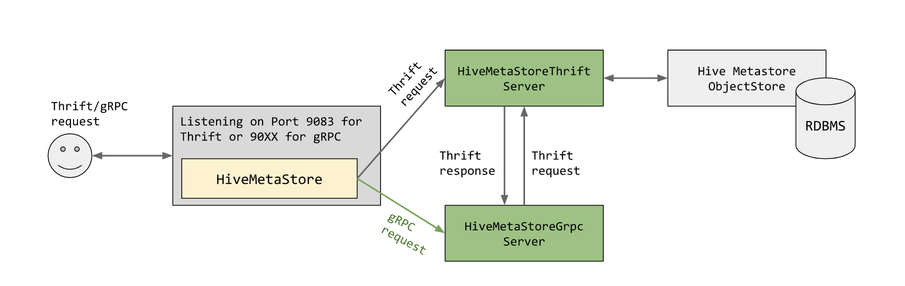

# Apache Hive : Enabling gRPC in Hive/Hive Metastore (Proposal)

Contacts: Cameron Moberg (Google), Zhou Fang (Google), Feng Lu (Google), Thejas Nair (Cloudera), Vihang Karajgaonkar (Cloudera), Naveen Gangam (Cloudera)

Last upated: 7/31/2020

* [Objective]()
* [Background]()
* [Design]()
	+ [Overview]()
	+ [Implementation]()
		- [Pluggable gRPC Support]()
		- [Hive Metastore Server]()
			* [Class Change]()
			* [Config Changes]()
		- [Hive Metastore Client]()
			* [Class Change]()
			* [Configuration Changes]()
* [Summary]()
* [Future Work]()

# Objective

* To modernize [Hive Metastore’s](https://cwiki.apache.org/confluence/display/Hive/AdminManual+Metastore+3.0+Administration) interface with a state-of-the-art serving layer based on gRPC while also keeping it backwards compatible with Thrift for minimal upgrade toil;
* To achieve this the proposed design is to add support for a proxy-layer between the Thrift interface and a new gRPC interface that allows for in-memory request/response translation in-between;
* To expand the Hive client to work with Hive Metastore server in both gRPC and Thrift mode.

# Background

Hive Metastore is the central repository of Apache Hive (among others like [Presto](https://prestodb.io/) and [Spark](https://spark.apache.org/)) metadata. It stores metadata for tables (e.g., schema, location, and statistics) and partitions in a relational database. It provides client access to this information by using a Thrift Metastore API.

[The Apache Thrift](https://thrift.apache.org/) software framework, for scalable cross-language services development, combines a software stack with a code generation engine to build services that work efficiently and seamlessly between C++, Java, Python, and many other languages.

[gRPC](https://grpc.io/) is a modern open source high performance RPC framework that can run in any environment. It can efficiently connect services in and across data centers with pluggable support for load balancing, tracing, health checking and authentication. It is also applicable in the last mile of distributed computing to connect devices, mobile applications and browsers to backend services.

Providing gRPC as an option to access Metastore brings us many benefits. Compared to Thrift, gRPC supports streaming that provides better performance for large requests. In addition, it is extensible to more advanced authentication features and is fully compatible with Google’s IAM service that supports fine grained permission checks. A path to integrate gRPC with Hive Metastore is sketched out by this proposal. 

# Design

## Overview

The overall design of the gRPC support in Hive Metastore is illustrated in Fig.1. On the server side, based on user configuration, the Hive Metastore Server can listen on a port for Thrift or gRPC request. The lifecycle of a Thrift request has not been changed. For a gRPC request, the new *HiveMetastoreGrpcServer* will translate an incoming gRPC request into a Thrift request, transparently pass it to *HiveMetastoreThriftServer*, and translate the response back into gRPC.

On the client side, a similar design is used to support converting outgoing requests from Thrift to gRPC. 



Figure 1. An overview of the new gRPC endpoint of Hive Metastore. *Clarification: The only network I/O that occurs is between the user and serving processes in* *HiveMetaStore* *(gRPC, Thrift, or both).*

The implementation details are described in the following sections.

## Implementation

### Pluggable gRPC Support

To have a loose coupling between Hive Metastore and the gRPC layer, we propose to have a pluggable layer which implements only a hook in the Hive Metastore repository, while implements the gRPC proxy library in a separate repository. To enable the gRPC server, a user set “metastore.custom.server.class” in the Hive configuration to the class path of the server in gRPC library. Hive Metastore will then instantiate this class and start the gRPC server described as follows. Here is an [example](https://github.com/apache/hive/blob/master/service/src/java/org/apache/hive/service/auth/CustomAuthenticationProviderImpl.java) of a similar pluggable library in Hive.

The gRPC layer at the client side is implemented similarly in the separate repository. Changes need to be made into Hive repository to load the gRPC Hive client if enabled by config. For example, both [SessionHiveMetastoreClient.java](https://github.com/apache/hive/blob/1d18fd9a27cfbe7f6d735e422d6d9f79f07c3c22/ql/src/java/org/apache/hadoop/hive/ql/metadata/SessionHiveMetaStoreClient.java) and [RetryingMetastoreClient.java](https://github.com/apache/hive/blob/7298dc162f3c04efc880659ffdf5b075606c2557/standalone-metastore/metastore-common/src/main/java/org/apache/hadoop/hive/metastore/RetryingMetaStoreClient.java) can be amended to dynamically load the HiveMetastore gRPC client if the metastore.uris starts with “grpc://”.

### Hive Metastore Server

#### **Class Change**

*The following is assuming modification of the* *standalone-metastore* *package.*

To add support for the Hive Metastore to be able to receive and process gRPC requests, additional Java classes need to be created. Due to the current coupling between application logic and startup logic in [HiveMetaStore.java](https://github.com/apache/hive/blob/master/standalone-metastore/metastore-server/src/main/java/org/apache/hadoop/hive/metastore/HiveMetaStore.java), a separation of logic would first be required that breaks out the Thrift implementation into a *HiveMetaStoreThriftServer.java* class that can then be instantiated by the *HiveMetaStore.java* class (the main driver program). After that, the new gRPC implementation Java class, *HiveMetaStoreGrpcServer.java*, can be similarly created and referenced.

The Thrift RPC definition files must be translated into gRPC protobuf files, while this has some direct incompatibilities (such as sets), these can be worked on a per-method implementation basis rather than worry about it in the protobuf files. An example service protobuf definition is shown below; keep in mind Table and CreateTableResponse are both also defined in protobuf files. There is no reference to Thrift files.

**proto**

```
service HiveMetaStoreGrpc {
    rpc getTable(Table) returns (GetTableResponse);
}
```

  

Once the service methods are defined, the gRPC server can be created so it can be instantiated by the driver class. The *HiveMetaStoreGrpcServer.java* class signature would [implement the gRPC server](https://grpc.io/docs/languages/java/basics/#simple-rpc) interface like below:

**class**

```
private class HiveMetaStoreGrpcServer extends HiveMetaStoreGrpc.HiveMetaStoreImplBase
```

An example implementation of *getTable* translation layer is shown below.

**sample**

```
// Returns gRPC Response, and takes in gRPC GetTableRequest
public GetTableResponse getTable(GetTableRequest grpcTableRequest) {
  // convertToThriftRequest is implemented by a different library, not in Hive code
  Table thriftGetTableRequest = convertToThriftRequest(grpcTableRequest);
  // Result is a Thrift API object    
  GetTableResult result = HiveMetaStoreThriftServer.get\_table(thriftTable);
  return convertToThriftResponse(result);
}

```

As shown in Figure 1, green elements are newly added class while yellow is modified from the current design.

#### **Config Changes**

With the potential of starting a new reachable endpoint the requirement of additional hive-site.xml configs are required. The current proposed configuration values are shown below.

* *metastore.custom.server.class* - string; the path to the class of the custom server; if configed to the gRPC server, Hive Metastore will load the class and use the server to handle gRPC requests
* *metastore.uris* (reuse existing field) - string; the socket of the listening gRPC server, used to set the gRPC port. In addition, the port can be modified by “hive --service metastore -p port\_number”.

Parsing *metastore.custom.server.class* is implemented in Hive Metastore repository, whereas parsing the gRPC specific configs can be offloaded to the gRPC library:

* *metastore.grpc.service.account.keyfile* - string, optional; the path to the JSON keyfile that the Metastore server will run as.
* *metastore.grpc.authentication.class* - string, optional; the gRPC class will use this class to perform authn/authz against the gRPC requests.
+ The detailed implementation of auth support is not in scope for this design proposal.

* Additional gRPC server configs; maximal request size, max connections, port, etc.

### Hive Metastore Client

#### **Class Change**

While a Hive Metastore that can support gRPC requests is still useful without any clients it would be helpful to also have the Hive client support gRPC communication with Hive Metastore. This is fairly similar to the previous section, but worth a section on its own for clarity.

The class [IMetaStoreClient](https://github.com/apache/hive/blob/master/standalone-metastore/metastore-common/src/main/java/org/apache/hadoop/hive/metastore/IMetaStoreClient.java) is a thin wrapper on top of the thrift interface and is implemented by [HiveMetaStoreClient](https://github.com/apache/hive/blob/master/standalone-metastore/metastore-common/src/main/java/org/apache/hadoop/hive/metastore/HiveMetaStoreClient.java), however this is an entirely thrift based implementation. As opposed to above, as the client we want to take in a Thrift request (usually generated by code itself), convert the request to gRPC, and then send it out on the wire to the desired listening gRPC server.

In this case however, for backwards compatibility the easiest way to add support for gRPC would be to create a new class HiveMetaStoreGrpcClient that implements the Thrift interface IMetaStoreClient, but instead of instantiating and calling and opening a Thrift client, we create a new gRPC client and convert the input Thrift requests to the relevant gRPC, and send them down the wire with the generated gRPC client.

Example Instantiation and usage of gRPC client:

**client**

```
ManagedChannel channel = ManagedChannelBuilder.forTarget(target)
    // Channels are secure by default (via SSL/TLS). For the example we disable TLS to avoid
    // needing certificates.
    .usePlaintext()
    .build();
HiveMetaStoreGrpc.HiveMetastore BlockingStub blockingStub = HiveMetaStoreGrpc.newBlockingStub(channel);
blockingStub.getTable(getTableRequest);
```

The definition of the *getTable* method is defined in the metastore server spec, so all the client needs to do is worry about conversion of the Thrift object to gRPC and which gRPC method to call.

#### Configuration Changes

Similar to the changes to the server config, a user can populate the following fields to user a gRPC enabled client:

* *metastore.custom.client.class* - string; the path to the custom client class; if configed to the gRPC client, Hive Metastore will dynamically load and use that client.
* *metastore.uris* (reuse existing field) - string; the socket of the listening gRPC server, can be separated by commas to be chosen randomly between all of them for load balancing purposes. Grpc connections should be prefixed as grpc://

# Summary

* Creation of the protobuf definition files for the gRPC client and server
* [a separate ASF licensed repo]:
+ Add an additional *HiveMetaStoreGrpcServer* class that implements the logic of the gRPC service methods that translates & explicitly calls the predefined Thrift implementation.
+ Add an additional *HiveMetaStoreGrpcClient* class that implements [IMetaStoreClient](https://github.com/apache/hive/blob/master/standalone-metastore/metastore-common/src/main/java/org/apache/hadoop/hive/metastore/IMetaStoreClient.java) that opens a gRPC connection with the gRPC metastore server and translates Thrift API requests to gRPC and sends to server

* Separate logic of *HiveMetaStore.java* so that a gRPC server, in addition to the Thrift server, can be initialized to making a clear distinction between Thrift and gRPC implementations.
* Add required configuration values and implement the dynamical gRPC class loading/instantiation wiring code inside Hive Metastore Server and Client (e.g., *SessionHiveMetastoreClient.java* and *RetryingMetastoreClient.java*).

# Future Work

* As this is simply adding gRPC support by calling the Thrift APIs via in-memory rather than network-io streaming support is not inherently gained. This is currently just a proposal to get gRPC support a foot in the door, and from there we can iterate on the implementation to add true streaming (or other) support.
* Look into adding a layer below [Hive.java](https://github.com/apache/hive/blob/master/ql/src/java/org/apache/hadoop/hive/ql/metadata/Hive.java) but above [IMetastoreClient.java](https://github.com/apache/hive/blob/e867d1c693e966706d3b7c6fe18e039a85928f51/standalone-metastore/metastore-server/src/main/java/org/apache/hadoop/hive/metastore/IMetaStoreClient.java) for Thrift/gRPC

## Attachments:


 

 

