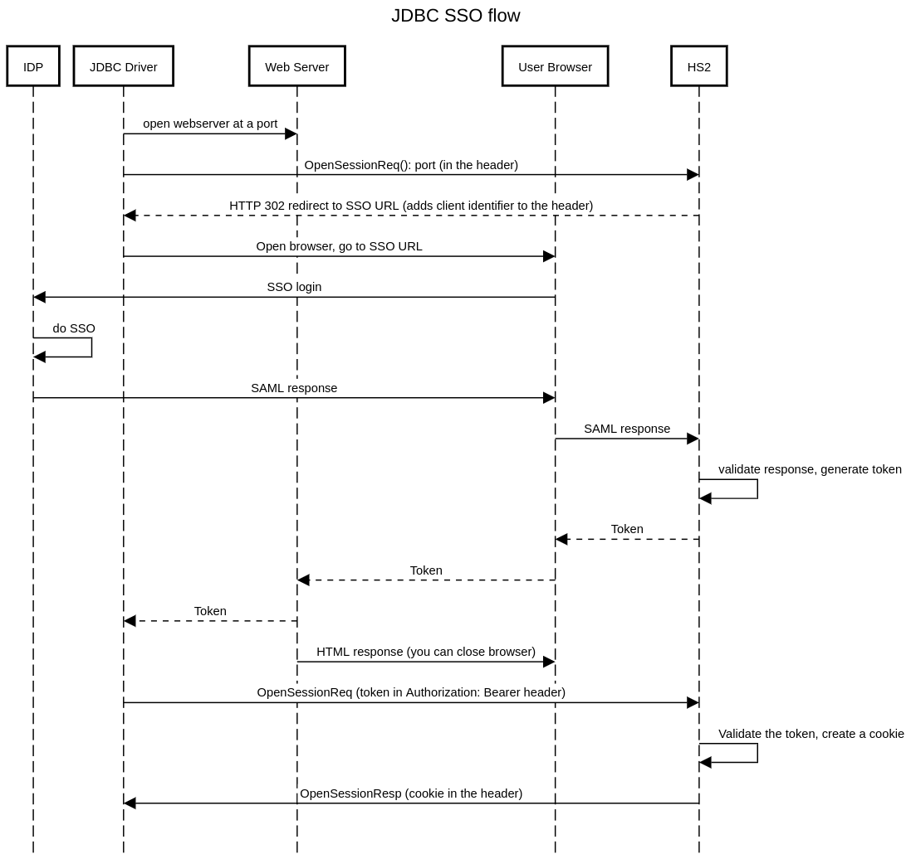

# Apache Hive : HIVE-24543: Support SAML 2.0 authentication mode

## Description

In cloud based deployments, it is common that the user identity is federated and managed externally by an identity provider (e.g Okta, PingIndentity, Azure AD). Integrating with such external identity providers (IDP) would help adoption and unlock use-cases where Hive is deployed in a cloud based environment and doesn't need user managed authentication mechanisms (e.g Ldap, Kerberos). There are primarily two authentication protocols which are standardized with such external identity providers namely (SAML 2.0 and OpenID connect). This design specifically focuses on SAML 2.0 but it can be extended to support OpenID connect as well in the future.

## Design

#### SAML 2.0

In this approach, we rely on using [SAML 2.0 protocol](http://docs.oasis-open.org/security/saml/Post2.0/sstc-saml-tech-overview-2.0.html) to exchange the authentication messages between the client and IDP and generate a SAML response object which is sent to the HiveServer2 from the IDP via browser as per the SAML specification. HiveServer2 can reuse the same port for its http connection and have a separate http path on it to receive the SAML Response. SAML 2.0 protocol is mainly browser dependent since it depends a lot on the redirect URLs which browser supports to control the SSO workflow. For the desktop based use-cases (JDBC/ODBC Driver running locally on a machine which has browser access) JDBC driver code will open a browser to execute this workflow. At the end of SSO workflow, the IDP will send back a signed SAML assertion to the HiveServer2’s assertion consumer service url (ACS). When the assertion is validated, HiveServer2 will generate a short lived token which is returned to the driver by redirecting the browser using a x-www-form-urlencoded response to a localhost port. This approach is similar to what is described in [RFC8252 section 7.3](https://tools.ietf.org/html/rfc8252#section-7.3). Driver will add the token to its authorization bearer header to make subsequent calls. HiveServer2 will validate the bearer token and the client identifier to allow the client to open a session.

#### Establishing trust with IDP

In order to make sure that the SAML assertions received by HiveServer2 are valid, HiveServer2 needs to establish a trust relationship with the IDP which is going to sign the SAML assertions. This can be done by manual configuration in the HiveServer2. In order to configure the HiveServer2 with the IDP metadata, following steps will need to be done before the HiveServer2 is started.

1. Fetch the IDP metadata xml file from the identity provider. The steps to extract the IDP metadata are specific for each IDP and users should follow the documentation of IDP to do that.
2. HiveServer2 will expose a configuration which will point to the idp-metadata.xml. When it is started it loads the IDP metadata file which includes its public key, SSO url, and entityId of the IDP. This information is used to generate authentication requests and validate the authentication response received by HiveServer2.
3. For the first version we will not support encrypted SAML assertions (since it would mean we need to exchange the public key of HiveServer2 with IDP) and will instead rely on the end-to-end TLS encryption for the connections between client and server. However, the SAML responses generated by IDP MUST be signed to validate the authenticity of the response.

#### SAML authentication workflow



  

#### Authentication Flow Details

1. **JDBC Driver**: Receives a connection url from the user-facing clients (Beeline, Tableau). The connection URL uses http transport and has auth=browser
2. **JDBC Driver**: Opens a port on the client machine to receive the server response. This port uses 127.0.0.1 as the bind address so that it doesn't accept traffic from the internet.
3. **JDBC Driver**: If the auth is browser, submits a HTTP post request to the HiveServer2. This could be a dummy Opensession() API call which will be redirected by HiveServer2 to SSO provider.
4. **HiveServer2**: Detects that it is configured using SSO, generates a HTTP 302 redirect with the location as SSO URL pointing to the IDP provider. Additionally, it includes a client identifier to the response header which is used by the driver for subsequent requests. This URL also contains a relayState id which is used by the server to track the SSO request.
5. **JDBC Driver**: Gets the URL, client identifier from the redirect response of the HiveServer2.
6. **JDBC Driver**: Opens the browser and points it to the given SSO url.
7. **User**: Authenticates with IDP using credentials and MFA as configured.
8. **IDP**: If authentication is successful, IDP sends a SAML response to the SP’s assertion consumer service URL as per the SAML 2.0 specification. Else, after a configurable timeout both the client and server will clean their respective states.
9. **HiveServer2**: Verifies if SAML assertion is valid.
10. **HiveServer2**: If the SAML assertion is valid, generates a response which includes short-lived token, status, and an informative message and respond to the browser with a form which submits on page load to the [http://localhost:port](http://localhostport) from step 2 in a x-www-form-urlencoded format. If the assertion is not valid, generates a failure response without token and includes a descriptive message.
11. **JDBC Driver**: Parses the response from the server. If the response is successful extracts the token from the response and adds it to the “Authorization: Bearer “ header of the subsequent request. Else, displays the appropriate error message to the user.
12. **HiveServer2**: Receives a post request which contains the bearer token. Validates the token, the client identifier and allows the connection to proceed. It generates a cookie which is used for subsequent requests.

#### Implementation Details

##### New configurations

Following new configurations will be added to the hive-site.xml which would need to be configured by the clients.

<property>  
  <name>hive.server2.authentication</name>  
  <value>SAML</value>  
</property>

This configuration will be set to SAML to indicate that the server will use SAML 2.0 protocol to authenticate the user. 

<property>  
  <name>hive.server2.saml2.idp.metadata</name>  
  <value>path_to_idp_metadata.xml</value>  
</property>

This configuration will provide a path to the IDP metadata xml file.

<property>  
  <name>hive.server2.saml2.sp.entity.id</name>  
  <value>test_sp_entity_id</value>  
</property>  
  
This configuration should be same the service provider entity id as configured in the IDP. Some identity providers require this to be same as the ACS URL.

<property>  
  <name>hive.server2.saml2.group.attribute.name</name>  
  <value>group_attribute_name</value>  
</property>

This configuration will be used to map the SAML attribute in the response to the groups of the user. This should be configured in the identity provider as the attribute name for the group information.

<property>  
  <name>hive.server2.saml2.group.filter</name>  
  <value>comma_separated_group_names</value>  
</property>

This configuration will be used to configure the allowed group names.

<property>  
  <name>hive.server2.saml2.sp.callback.url</name>  
  <value>callback_url_of_hiveserver2</value>  
</property>

The http URL endpoint where the SAML assertion is posted back by the IDP. Currently this must be on the same port as HiveServer2’s http endpoint and must be TLS enabled (https) on secure setups.

##### JDBC Driver changes

On the driver side the following new jdbc connection parameters will be defined/allowed.

1. New values of browser and token which will be allowed for the existing connection parameter auth.
2. [TBD] In case the auth is set to token, the value for token will be passed as the value of new keyword token.

For example, in case of browser the URL will look like

```
jdbc:hive2://HiveServer2-host:10001/default;transportMode=http;httpPath=cliservice;auth=browser
```
A token based URL will look like:

```
jdbc:hive2://HiveServer2-host:10001/default;transportMode=http;httpPath=cliservice;auth=token;token=<token_string>
```
The Jdbc connection parameters will be passed in over the connection URL. 

##### SSO mode URL validations

Driver makes sure that the SSO integration is only allowed when TLS enabled between driver and the server. If the SSL is not enabled, the driver should error out (or optionally warn the users based on a configuration override). Currently, both these modes will only be supported in http mode.

##### Browser mode

When the auth is browser the Driver will open a available port on the machine where the driver is running. Driver will make a http post request with this port number in the request header (it could be the same as the OpenSessionReq). This request will get a HTTP 302 response with the location set to the SSO URI. Additionally, the server will set a client identifier in the response header. This client identifier header must be sent by the driver in all the subsequent requests to the server.

Once the SSO URI is available, Driver must take the following actions:

1. Open a browser window and point it to the SSO URI. If there is no active session with the IDP, the user is expected to enter the credentials on the browser and complete the single-sign on workflow along with the MFA if configured with the IDP.
2. When the browser completes the SSO workflow, the IDP forwards the SAML response to the Assertion consumer service (ACS) URL of HiveServer2. The ACS will validate the response and return a HTTP form in the response  which is posted to the http://localhost:port using application/x-www-form-urlencoded encoding.

If the status is success, the token must be present and the driver will add the token as a bearer authorization HTTP header for the subsequent connection to open session with the key “Authorization: Bearer :”

If the status is error, the message field will include an appropriate error message which can be logged by the driver.

The driver will have a configurable timeout value which will be used to error out the connection attempt in case no response is received on the localhost:port until the given timeout. This configurable timeout value could be provided as a connection parameter. Additionally, the connection URL can provide a specific port to bind to on the localhost on the connection URL. For example, following URL will open a port 12345 and have a timeout of 120 seconds to complete the SSO flow.

```
jdbc:hive2://HiveServer2-host:10001/default;transportMode=http;httpPath=cliservice;auth=browser;samlResponsePort=12345;samlResponseTimeout=120
```
##### Token Expiry and renewal

In the initial version the token returned by the server will be used for a one-time validation within the default period of 30 seconds (token will be valid for only 30 seconds) which could be configurable. The token will be used by the server to set a cookie which will be used for further requests. However, this is a server side implementation detail which client does not need to be aware of. When the session expires the server will return a HTTP 401 status code which will be used by the clients to re authenticate using the browser flow again. Unfortunately, [RFC 7231](https://tools.ietf.org/html/rfc7231) does have an explicit status code for session expiration. However, the clients can detect if the response code of 401 is due to session expiry by keeping track of whether we are sending a token in the header in the previous request or not. In such case the JDBC Application can choose to close the connection or re-authenticate as per the application logic.

## Attachments:


 

 

