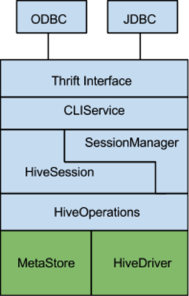
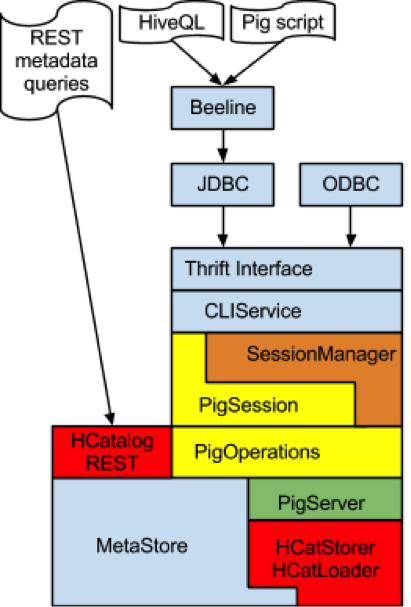

---

title: "Apache Hive : AccessServer Design Proposal"
date: 2024-12-12
----------------

# Apache Hive : AccessServer Design Proposal

# AccessServer Proposal

### Author: Carl Steinbach

## Overview

The technical approach described in the this document addresses the following high-level requirements:

1. Make Apache Hive’s data model and metadata services accessible to users of the Apache Pig dataflow programming language as well as other Hadoop language runtimes.
2. Make it possible for Hive users and users of other Hadoop language runtimes to share data stored in Hive’s HDFS data warehouse.
3. Accomplish requirements (1) and (2) while also enforcing Hive’s fine-grained authorization model.
4. Accomplish (1) and (2) while also ensuring the accuracy and consistency of secondary metadata artifacts such as indexes and statistics.

In order to satisfy these requirements we propose extending HiveServer2 in order to make it capable of hosting the Pig runtime execution engine in addition to the Hive runtime execution engine. Note that requirements (3) and (4) assume completion of the [parallel project](https://issues.apache.org/jira/secure/attachment/12554109/Hive_Authorization_Functionality.pdf) to implement consistent Hive authorization.

## Does HCatalog address these requirements?

HCatalog “is a table and storage management layer for Hadoop that enables users with different data processing tools - Pig, MapReduce, and Hive – to more easily read and write data on the grid ... HCatalog is built on top of the Hive metastore and incorporates Hive’s DDL.” “HCatalog provides read and write interfaces for Pig and MapReduce” built on top of Hive’s SerDes “and uses Hive’s command line interface for issuing data definition and metadata export commands.” This can also be summarized by saying that HCatalog is a set of wrapper APIs designed to make Hive’s MetaStore service and SerDe format handlers accessible to Pig and MapReduce. The MetaStore API wrappers and the SerDe wrappers are useful in making Hive metadata available to Pig and MapReduce programs.

Where does HCatalog in its current incarnation fall short?

### Authorization in HCatalog

HCatalog has a pluggable authorization system, with the only currently implemented plugin assuming a storage-based authorization model that uses the permissions of the underlying file system (HDFS) as the basis for determining the read and write permissions of each database, table, or partition. For example, in order to determine if a user has permission to read data from a table, HCatalog checks to see if the user has permission to read the corresponding subdirectory of Hive’s warehouse directory. With this authorization model, the read/write permissions that a user or group has for a particular database, table, or partition are determined by the filesystem permissions on the corresponding subdirectory in Hive’s warehouse.

### Column-level Access Controls

The file system approach cannot support column-level access controls. This is a consequence of the fact that Hive’s data model makes it possible to store table data in flat files where each file may contain multiple columns. In order for HCatalog to support column-level ACLs it will need to defer to Hive for authorization decisions, i.e. it will need Hive authorization.

AccessServer will support a deployment choice of using Hive authorization or using file system authorization (because some sites prefer it). File system authorization will happen through DoAs proxying.

### Integrity of Indexes and Statistics

Another problem with file system authorization is that it makes it difficult to ensure the consistency and integrity of Hive’s indexes and statistics. HCatalog’s file system authorization model allows users to directly access and manipulate the contents of the warehouse directory without going through Hive or HCatalog. Adding, removing, or altering a file in any of these directories means that any indexes or statistics that were previously computed based on the contents of that directory now need to be invalidated and regenerated. There is no mechanism for notifying Hive that changes have been made, and Hive is precluded from determining this on its own due to the bedrock design principle that it does not track individual files in the warehouse subdirectories.

### Data Model Impedance Mismatch

Hive has a powerful data model that allows users to map logical tables and partitions onto physical directories located on HDFS file systems. As was mentioned earlier, one of the bedrock design principles of this data model is that Hive does not track the individual files that are located in these directories, and instead delegates this task to the HDFS NameNode. The primary motivation for this restriction is that it allows the Metastore to scale by reducing the FS metadata load. However, problems arise when we try to reconcile this data model with an authorization model that depends on the underlying file system permissions, and which consequently can't ignore the permissions applied to individual files located in those directories.

HCatalog's Storage Based Authorization model is explained in more detail in the [HCatalog documentation](http://hive.apache.org/docs/hcat_r0.5.0/authorization.html), but the following set of quotes provides a good high-level overview:

> ... when a file system is used for storage, there is a directory corresponding to a database or a table. With this authorization model, **the read/write permissions a user or group has for this directory determine the permissions a user has on the database or table**.
>
> ...
>
> For example, an alter table operation would check if the user has permissions on the table directory before allowing the operation, even if it might not change anything on the file system.
>
> ...
>
> When the database or table is backed by a file system that has a Unix/POSIX-style permissions model (like HDFS), there are read(r) and write(w) permissions you can set for the owner user, group and ‘other’. The file system’s logic for determining if a user has permission **on the directory or file** will be used by Hive.

There are several problems with this approach, the first of which is actually hinted at by the inconsistency highlighted in the preceding quote. To determine whether a particular user has read permission on table `foo`, HCatalog's [HdfsAuthorizationProvider class](http://svn.apache.org/repos/asf/hive/branches/branch-0.11/hcatalog/core/src/main/java/org/apache/hcatalog/security/HdfsAuthorizationProvider.java) checks to see if the user has read permission on the corresponding HDFS directory `/hive/warehouse/foo` that contains the table's data. However, in HDFS having [read permission on a directory](http://hadoop.apache.org/docs/current/hadoop-project-dist/hadoop-hdfs/HdfsPermissionsGuide.html) only implies that you have the ability to list the contents of the directory – it doesn't have any affect on your ability to read the files contained in the directory.

### Execution container

HCatalog includes a subproject Templeton which exposes two sets of REST APIs: a set to access Hive metadata and a set to launch and manage MapReduce jobs. A metadata REST API is something we want for AccessServer. HCatalog is not the right place for job management. Templeton has copied the Oozie code for job submission and management. We think users should use Oozie's REST APIs to submit jobs to Oozie. The HCatalog plan was to implement JDBC and ODBC on top of the Templeton job control REST API. That would be significant work (while we already have JDBC and ODBC for HiveServer2 that can be used for Pig as well) and would not allow for interactive JDBC or ODBC usage since Templeton executes each instruction as an Oozie job.

## Technical Approach

We will modify HiveServer2 in order to make it capable of supporting language runtimes other than HQL, in effect converting HiveServer2 into an application server for pluggable modules with the immediate goal of supporting Pig. The end result of these efforts will be called AccessServer.

Before discussing these modifications it is important to first understand the basic design of HiveServer2.

### HiveServer2 Design Overview

The following diagram is a block-level representation of the major submodules in HiveServer2 with horizontal boundaries signifying dependencies. Green modules existed in Hive before the HiveServer2 project commenced, while blue modules were implemented as part of the HiveServer2 project.

The core of HiveServer2 is the HiveSession class. This class provides a container for user session state and also manages the lifecycle of operations triggered by the user. In this context an operation is any command exposed through the CLIService API that can generate a result set. This includes the ExecuteStatement() operation and metadata operations such as GetTables() and GetSchemas(). Each of these operations is implemented by a specific Operation subclass. In order to execute Hive queries the ExecuteStatementOperation makes use of the pre-existing HiveDriver class. HiveDriver encapsulates Hive’s compiler and plan execution engine, and in most respects is very similar to Pig’s PigServer class.

### AccessServer Design

The following diagram gives a quick overview of the changes required to support the Pig runtime engine in AccessServer. For simplicity we have removed Hive-specific components from the diagram such as the HiveOperation and HiveSession classes.

In the diagram blue denotes existing components in HiveServer2 that do not require modification. This includes the Thrift interface, JDBC/ODBC drivers, CLIService, and the Metastore.

Orange denotes existing HiveServer2 components that must be modified. We need to modify the SessionManager in order to support pluggable session factories. Note that the CLIService API already allows clients to request a specific Session type via a set of configuration parameters that are part of the OpenSession call.

Yellow denotes new components that must be fashioned from scratch: the PigSession class and the set of Pig Operation classes. The following implementation details relevant to these classes are worth noting:

* We will need to provide Pig-specific implementations of the metadata operations defined in the CLIService API, e.g. GetTables, GetSchemas, GetTypeInfo, etc. In some cases we will be able to reuse the Hive version of these operations without modification (e.g. GetSchemas). Other metadata operations such as GetTables can be based on the corresponding Hive versions, but must be modified in order to filter out catalog objects such as indexes and views that Pig does not support.
* The Pig version of the ExecuteStatementOperation will likely require the most effort to implement. This class will function as an adaptor between the AccessServer Session API and an instance of the PigServer class.

Finally, red is used in the preceding diagram to highlight HCatalog components we plan to use: the HCatStorer and HCatLoader modules, and the REST API. These classes function as an adaptor layer that makes Hive’s metadata and SerDes accessible to Pig.

## Attachments:

