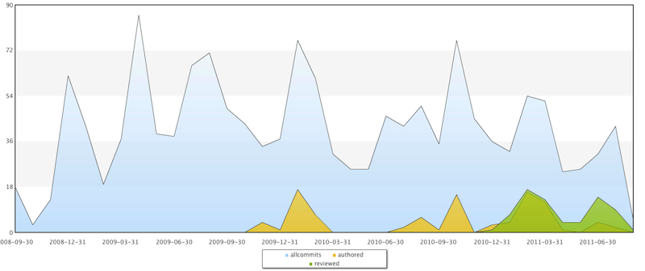

# Apache Hive : BecomingACommitter

# Becoming A Hive Committer

The Apache Software Foundation defines [generic guidelines for what it means to be a committer](http://www.apache.org/dev/committers.html#committer-responsibilities). However, it leaves the question of whether a particular contributor is ready to become a committer on a project up to the judgement of that project's PMC. This wiki page attempts to explain what that means for the Hive project.

## Committer Zen

Contributors often ask Hive PMC members the question, "What do I need to do in order to become a committer?" The simple (though frustrating) answer to this question is, "If you want to become a committer, behave like a committer." If you follow this advice, then rest assured that the PMC will notice, and committership will seek you out rather than the other way around. So besides continuing to contribute high-quality code and tests, there are many other things that you should naturally be undertaking as part of getting deeper into the project's life:

* help out users and other developers on the mailing lists, in JIRA, and in IRC
* review and test the patches submitted by others; this can help to offload the burden on existing committers, who will definitely appreciate your efforts
* participate in discussions about releases, roadmaps, architecture, and long-term plans
* help improve the website and the wiki
* participate in (or even initiate) real-world events such as user/developer meetups, papers/talks at conferences, etc
* improve project infrastructure in order to increase the efficiency of committers and other contributors
* help raise the project's quality bar (e.g. by setting up code coverage analysis)
* as much as possible, keep your activity sustained rather than sporadic

Of course, before becoming a committer, there are certain things you can't actually do (e.g. commit a patch to source control; cast a binding vote), but the more you participate in the activities which surround these actions, the more ready you will be to eventually carry them out yourself.

## Visualize

The graph below shows monthly patch authorship and commit activity for an actual Hive committer. The blue shows all commits going into Hive from all committers. The orange shows patches authored by this committer, whereas the green shows patches reviewed and committed by him after they were authored by others. (Not shown are reviews he participated in before becoming a committer.)

Important points to notice:

* it took a while for him to become a committer: we'd like to make sure that all committers are truly dedicated to the role
* after becoming a committer, he began fulfilling the role by actively reviewing and committing many patches from others (even more than those he continued to author himself!), and sustained that energy over time
* we're using a narrow quantitative measure here (patch count) purely for the purpose of visualizing activity level over time; what we're really interested in are quality and value brought to the project across a wide range of activities (for example, the committer in this case also volunteered to serve as release manager for multiple releases of Hive, starting even before becoming a committer)

## The Dark Side

It should go without saying, but here it is anyway: your participation in the project should be a natural part of your work with Hive; if you find yourself undertaking tasks "so that you can become a committer", then you're doing it wrong, young padawan. This is particularly true if your motivations for wanting to become a committer are primarily negative or self-centered, e.g.

* you desire the power of a -1 vote (these should be used only extremely rarely in a healthy project)
* you want to push your own changes through unreviewed (Hive follows a review-before-commit policy where even committers need to wait for a +1 from another committer)
* you only want to commit changes from other contributors within a particular affiliation group (e.g. coworkers in the same corporation); the committer role is about furthering a diverse project, not a narrow agenda

## Attachments:

 

 

