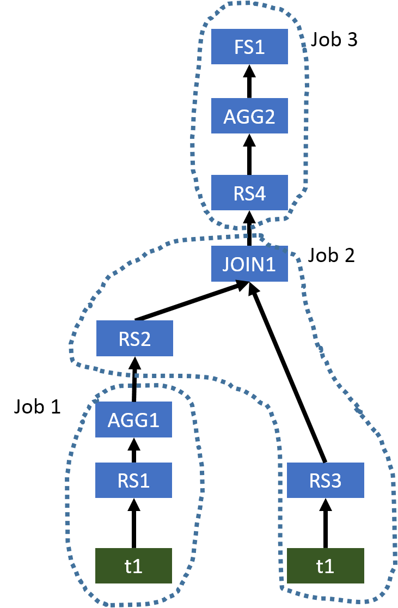
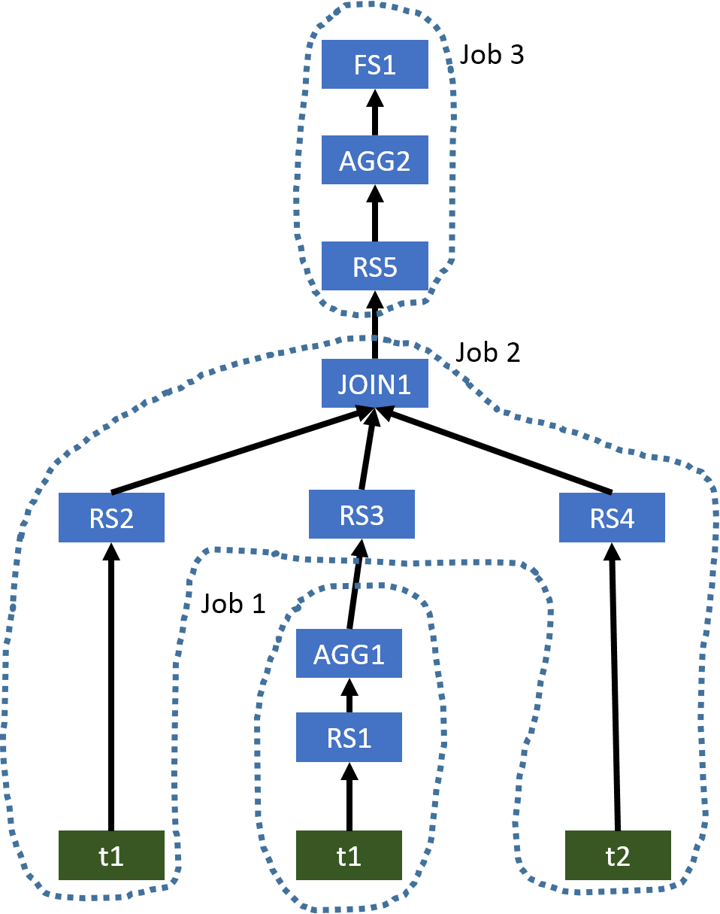
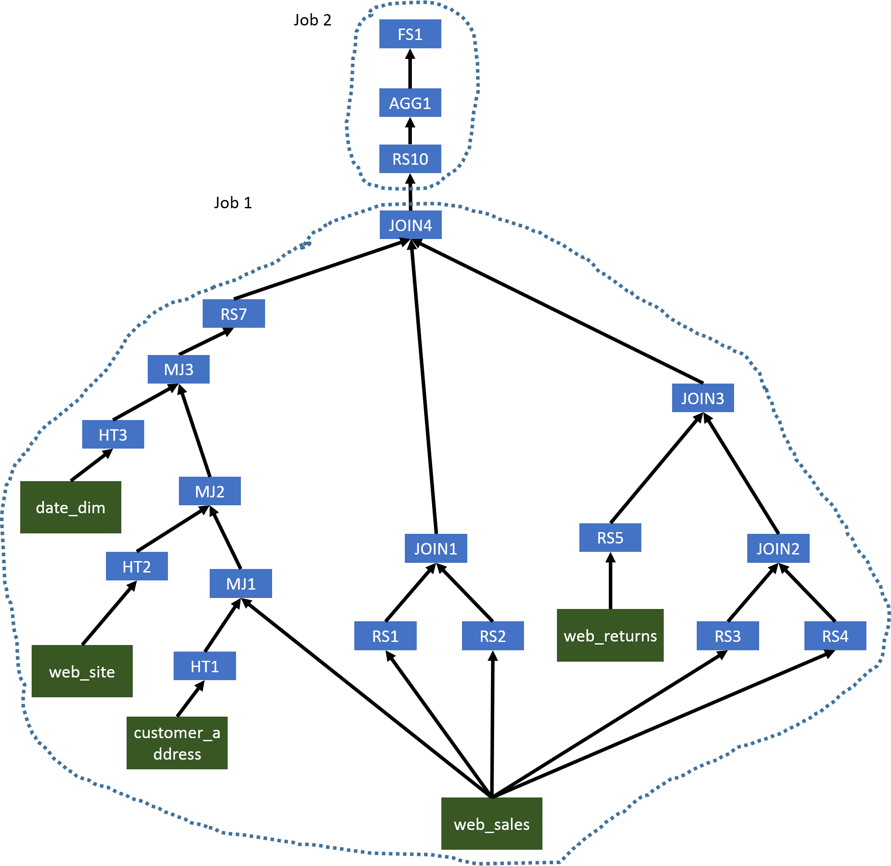

# Apache Hive : Correlation Optimizer

This page documents Correlation Optimizer. It was originally introduced by [HIVE-2206](https://issues.apache.org/jira/browse/HIVE-2206) and based on the idea of YSmart [1]. To turn on this optimizer, you can use ...

```
set hive.optimize.correlation=true;
```

## 1. Overview

In Hadoop environments, an SQL query submitted to Hive will be evaluated in distributed systems. Thus, after generating a query operator tree representing the submitted SQL query, Hive needs to determine what operations can be executed in a task which will be evalauted in a single node. Also, since a MapReduce job can shuffle data data once, Hive also needs to cut the tree to multiple MapReduce jobs. It is important to cut an operator tree to multiple MapReduce in a good way, so the generated plan can evaluate the query efficiently.

When generating an operator tree for a given SQL query, Hive identifies when to shuffle the data through operations which may need to shuffle data. For example, a `JOIN` operation may need to shuffle the input data if input tables have not been distributed by join columns. However, in a complex query, it is possible that the input data of an operation which may need to shuffle the input data has already been partitioned in the desired way. For example, it is possible we can have a query like `SELECT t1.key, sum(value) FROM t1 JOIN t2 ON (t1.key = t2.key) GROUP BY t1.key`. In this example, both `JOIN` operation and `GROUP BY` operation may need to shuffle the input data. However, because the output of `JOIN` operation is the input of `GROUP BY` operation and it has been already partitioned by `t1.key`, we do not need to shuffle the data for `GROUP BY` operation. However, Hive is not aware this correlation between `JOIN` operation and `GROUP BY` operation and thus it will generate two separate MapReduce jobs to evaluate this query. Basically, we unnecessarily shuffle the data for `GROUP BY` operation. In a more complex query, correlation-unaware query planning can generate a very inefficient execution plan and result in poor performance.

Before we integrating Correlation Optimizer into Hive, Hive has ReduceSink Deduplication Optimizer which can figure out if we need to shuffle data for chained operators. However, to support more complex operator trees, we need a more general-purpose optimizer and a mechanism to correctly execute optimized plan. Thus, we have designed and implemented Correlation Optimizer and two operators for evaluating optimized plans. It is worth noting that it is better to use ReduceSink Deduplication Optimizer to handle simple cases first and then use Correlation Optimizer to handle more complex cases.

## 2. Examples

At first, let's take a look at three examples. For every query, we show the original operator tree generated by Hive and the optimized operator tree. To be concise, we only show the following operators, which are `FileSinkOperator (FS)`, `GroupByOperator (AGG)`, `HashTableSinkOperator (HT)`, `JoinOperator (JOIN)`, `MapJoinOperator (MJ)`, and `ReduceSinkOperator (RS)`. Also, in every query, we add comments (e.g. /*JOIN1*/) to indicate the node in the operator tree that an operation belongs to.

### 2.1 Example 1

```
SELECT tmp1.key, count(*)
FROM (SELECT key, avg(value) AS avg
      FROM t1
      GROUP BY /*AGG1*/ key) tmp1
JOIN /*JOIN1*/ t1 ON (tmp1.key = t2.key)
WHERE t1.value > tmp1.avg
GROUP BY /*AGG2*/ tmp1.key;

```

The original operator tree generated by Hive is shown below.

  
   
 **Figure 1: The original operator tree of Example 1 generated by Hive**

This plan uses three MapReduce jobs to evaluate this query. However, `AGG1`, `JOIN1`, and `AGG2` all require the column `key` to be the partitioning column for shuffling the data. Thus, we do not need to shuffle the data in the same way three times. We only need to shuffle the data once, and thus a single MapReduce job is needed. The optimized operator tree is shown below.

  
   
 **Figure 2: The optimized operator tree of Example 1**

Since the input table of `AGG1` and the left table of `JOIN1` are both `t1`, when we use a single MapReduce job to evaluate this query, Hive only needs to scan `t1` once. While, in the original plan, `t1` is used in two MapReduce jobs, and thus it is scanned twice.

### 2.2 Example 2

```
SELECT tmp1.key, count(*)
FROM t1
JOIN /*JOIN1*/ (SELECT key, avg(value) AS avg
                FROM t1
                GROUP BY /*AGG1*/ key) tmp1 ON (t1.key = tmp1.key)
JOIN /*JOIN1*/ t2 ON (tmp1.key = t2.key)
WHERE t2.value > tmp1.avg
GROUP BY /*AGG2*/ t1.key;

```

The original operator tree generated by Hive is shown below.

  
   
 **Figure 3: The original operator tree of Example 2 generated by Hive**

This example is similar to Example 1. The optimized operator tree only needs a single MapReduce job, which is shown below.

  
   
 **Figure 4: The optimized operator tree of Example 2**

### 2.3 Example 3

```
SELECT count(distinct ws1.ws\_order\_number) as order\_count,
       sum(ws1.ws\_ext\_ship\_cost) as total\_shipping\_cost,
       sum(ws1.ws\_net\_profit) as total\_net\_profit
FROM web\_sales ws1
JOIN /*MJ1*/ customer\_address ca ON (ws1.ws\_ship\_addr\_sk = ca.ca\_address\_sk)
JOIN /*MJ2*/ web\_site s ON (ws1.ws\_web\_site\_sk = s.web\_site\_sk)
JOIN /*MJ3*/ date\_dim d ON (ws1.ws\_ship\_date\_sk = d.d\_date\_sk)
LEFT SEMI JOIN /*JOIN4*/ (SELECT ws2.ws\_order\_number as ws\_order\_number
               	          FROM web\_sales ws2 JOIN /*JOIN1*/ web\_sales ws3
               	          ON (ws2.ws\_order\_number = ws3.ws\_order\_number)
               	          WHERE ws2.ws\_warehouse\_sk <> ws3.ws\_warehouse\_sk) ws\_wh1
ON (ws1.ws\_order\_number = ws\_wh1.ws\_order\_number)
LEFT SEMI JOIN /*JOIN4*/ (SELECT wr\_order\_number
               	          FROM web\_returns wr
               	          JOIN /*JOIN3*/ (SELECT ws4.ws\_order\_number as ws\_order\_number
                                          FROM web\_sales ws4 JOIN /*JOIN2*/ web\_sales ws5
                                          ON (ws4.ws\_order\_number = ws5.ws\_order\_number)
                                          WHERE ws4.ws\_warehouse\_sk <> ws5.ws\_warehouse\_sk) ws\_wh2
                          ON (wr.wr\_order\_number = ws\_wh2.ws\_order\_number)) tmp1
ON (ws1.ws\_order\_number = tmp1.wr\_order\_number)
WHERE d.d\_date >= '2001-05-01' and
      d.d\_date <= '2001-06-30' and
      ca.ca\_state = 'NC' and
      s.web\_company\_name = 'pri';

```

The original operator tree generated by Hive is shown below.

  
   
 **Figure 5: The original operator tree of Example 3 generated by Hive**

In this complex query, we will first have several MapJoins (`MJ1`, `MJ2`, and `MJ3`) which can be evaluated in the same Map phase. Since `JOIN1`, `JOIN2`, `JOIN3`, and `JOIN4` use the same column as the join key, we can use a single MapReduce job to evaluate all operators before `AGG1`. The second MapReduce job will generate the final results. The optimized operator tree is shown below.

  
   
 **Figure 6: The optimized operator tree of Example 3**

## 3. Intra-query Correlations

In Hive, a submitted SQL query needs to be evaluated in a distributed system. When evaluating a query, data may need to shuffled sometimes. Based on the nature of different data operations, operators in Hive can be divided to two categories.

1. Operators which do not require data shuffling. Examples are `TableScanOperator`, `SelectOperator` and `FilterOperator`.
2. Operators which require data shuffling. Examples are `GroupByOperator` and `JoinOperator`.

For an operator requiring data shuffling, Hive will add one or multiple `ReduceSinkOperators` as parents of this operator (the number of `ReduceSinkOperators` depends on the number of inputs of the operator requiring data shuffling). Those `ReduceSinkOperators` form the boundary between the Map phase and Reduce phase. Then, Hive will cut the operator tree to multiple pieces (MapReduce tasks) and each piece can be executed in a MapReduce job.

For a complex query, it is possible that a input table is used by multiple MapReduce tasks. In this case, this table will be loaded multiple times when the original operator tree is used. Also, when generating those `ReduceSinkOperators`, Hive does not consider if the corresponding operator requiring data shuffling really needs a re-partitioned input data. For example, in the original operator tree of [Example 1]() ([Figure 1]()), `AGG1`, `JOIN1`, and `AGG2` require the data been shuffled in the same way because all of them require the column `key` to be the partitioning column in their corresponding `ReduceSinkOperators`. But, Hive is not aware this correlation between `AGG1`, `JOIN1`, and `AGG2`, and still generates three MapReduce tasks.

Correlation Optimizer aims to exploit two intra-qeury correlations mentioned above.

1. Input Correlation: A input table is used by multiple MapReduce tasks in the original operator tree.
2. Job Flow Correlation: Two dependent MapReduce tasks shuffle the data in the same way.

## 4. Correlation Detection

In Hive, every query has one or multiple terminal operators which are the last operators in the operator tree. Those terminal operators are called FileSinkOperatos. To give an easy explanation, if an operator A is on another operator B's path to a FileSinkOperato, A is the downstream of B and B is the upstream of A.

For a given operator tree like the one shown in [Figure 1](), the Correlation Optimizer starts to visit operators in the tree from those FileSinkOperatos in a depth-first way. The tree walker stops at every ReduceSinkOperator. Then, a correlation detector starts to find a correlation from this ReduceSinkOperator and its siblings by finding the furthest correlated upstream ReduceSinkOperators in a recursive way. If we can find any correlated upstream ReduceSinkOperator, we find a correlation. Currently, there are three conditions to determine if a upstream ReduceSinkOperator and an downstream ReduceSinkOperator are correlated, which are

1. emitted rows from these two ReduceSinkOperators are sorted in the same way;
2. emitted rows from these two ReduceSinkOperators are partitioned in the same way; and
3. these ReduceSinkOperators do not have any conflict on the number reducers.

Interested readers may refer to our [implementation](https://svn.apache.org/viewvc/hive/trunk/ql/src/java/org/apache/hadoop/hive/ql/optimizer/correlation/CorrelationOptimizer.java?view=log) for details.

During the correlation detection, a JoinOperator or a UnionOperator can introduce branches to the searching path. For a JoinOperator, its parents are all ReduceSinkOperators. When the detector reaches a JoinOperator, it will check if all parents of this JoinOperator are correlated to the downstream ReduceSinkOperator. Because a JoinOperator contains one or multiple 2-way Join operations, for a ReduceSinkOperator, we can determine if another ReduceSinkOperator appearing in the same Join operation is correlated based on the Join type and positions of these ReduceSinkOperators in the Join operation with the following two rules.

1. If a ReduceSinkOperator represents the left table of a INNER JOIN, a LEFT OUTER JOIN, or a LEFT SEMI JOIN, the ReduceSinkOperator representing the right table is also considered correlated; and
2. If a ReduceSinkOperator represents the right table of a INNER JOIN, or a RIGHT OUTER JOIN, the ReduceSinkOperator representing the left table is also considered correlated.

With these two rules, we start to analyze those parent ReduceSinkOperators of the JoinOperator from every ReduceSinkOperator which has columns appearing in the join clause and then we can find all correlated ReduceSinkOperators recursively. If we can find that all parent ReduceSinkOperators are correlated from every ReduceSinkOperator which has columns appearing in the join clause, we will continue the correlation detection on this branch. Otherwise, we will determine that none of ReduceSinkOperator for the JoinOperator is correlated and stop the correlation detection on this branch.

For a UnionOperator, none of its parents will be a ReduceSinkOperator. So, we check if we can find correlated ReduceSinkOperators for every parent branch of this UnionOperator. If any branch does not have a ReduceSinkOperator, we will determine that we do not find any correlated ReduceSinkOperator at parent branches of this UnionOperator.

During the process of correlation detection, it is possible that the detector can visit a JoinOperator which will be converted to a Map Join later. In this case, the detector stops searching the branch containing this Map Join. For example,  
in [Figure 5](), the detector knows that MJ1, MJ2, and MJ3 will be converted to Map Joins.

## 5. Operator Tree Transformation

In a correlation, there are two kinds of ReduceSinkOperators. The first kinds of ReduceSinkOperators are at the bottom layer of a query operator tree which are needed to emit rows to the shuffling phase. For example, in [Figure 1](), RS1 and RS3 are bottom layer ReduceSinkOperators. The second kinds of ReduceSinkOperators are unnecessary ones which can be removed from the optimized operator tree. For example, in [Figure 1](), RS2 and RS4 are unnecessary ReduceSinkOperators. Because the input rows of the Reduce phase may need to be forwarded to different operators and those input rows are coming from a single stream, we add a new operator called DemuxOperator to dispatch input rows of the Reduce phase to corresponding operators. In the operator tree transformation, we first connect children of those bottom layer ReduceSinkOperators to the DemuxOperator and reassign tags of those bottom layer ReduceSinkOperators (the DemuxOperator is the only child of those bottom layer ReduceSinkOperators). In the DemuxOperator, we record two mappings. The first one is called newTagToOldTag which maps those new tags assigned to those bottom layer ReduceSinkOperators to their original tags. Those original tags are needed to make JoinOperator work correctly. The second mapping is called newTagToChildIndex which maps those new tags to the children indexes. With this mapping, the DemuxOperator can know the correct operator that a row needs to be forwarded based on the tag of this row. The second step of operator tree transformation is to remove those unnecessary ReduceSinkOperators. To make the operator tree in the Reduce phase work correctly, we add a new operator called MuxOperator to the original place of those unnecessary ReduceSinkOperators. It is worth noting that if an operator has multiple unnecessary ReduceSinkOperators as its parents, we only add a single MuxOperator.

## 6. Executing Optimized Operator Tree in the Reduce Phase

In the Reduce phase, the ExecReducer will forward all reduce input rows to DemuxOperator first. Currently, blocking operators in the reduce phase operator tree share the same keys. Other cases will be supported in future work. Then, DemuxOperator will forward rows to their corresponding operators. Because a Reduce plan optimized Correlation Optimizer can be a tree structure, we need to coordinate operators in this tree to make the Reduce phase work correctly. This coordination mechanism is implemented in ExecDriver, DemuxOperator and MuxOperator.

When a new row is sent to the ExecDriver, it checks if it needs to start a new group of rows by checking values of those key columns. If a new group of rows is coming, it first invokes DemuxOperator.endGroup. Then, the DemuxOperator will ask its children to process their buffered rows and propagate the endGroup call to the operator tree. Finally, DemuxOperator will propagate processGroup call to the operator tree. Usually, the implementation of processGroup in an operator only propagates this call to its children. MuxOperator is the one that overrides processGroup. When a MuxOperator gets the processGroup call, it check if all its parent operators have invoked this call. If so, it will ask its child to generate results and propagate processGroup to its child. Once the processGroup has been propagated to all operators, the DemuxOperator.endGroup will return and ExecDriver will propagate startGroup to the operator tree.

For every row sent to the ExecDriver, it also has a tag assigned by a corresponding RediceSinkOperator at the Map phase. In a row group (rows having the same key), rows are also sorted by their tags. When the DemuxOperator sees a new tag coming, it knows all child operators associated with tags smaller than this new coming tag will not have any input within the current row group. Thus, it can call endGroup and processGroup of those operators earlier. With this logic, within a row group, the input rows of every operator in the operator tree are also ordered by tags, which is required by JoinOperator. This logic also makes rows in the buffer of an operator be emitted as quickly as possible, which avoids unnecessary memory footprint contributed from buffering unnecessary rows.

## 7. Related Jiras

The umbrella jira is [HIVE-3667](https://issues.apache.org/jira/browse/HIVE-3667).

### 7.1 Resolved Jiras

* [HIVE-1772](https://issues.apache.org/jira/browse/HIVE-1772)
* [HIVE-2206](https://issues.apache.org/jira/browse/HIVE-2206)
* [HIVE-3430](https://issues.apache.org/jira/browse/HIVE-3430)
* [HIVE-3670](https://issues.apache.org/jira/browse/HIVE-3670)
* [HIVE-3671](https://issues.apache.org/jira/browse/HIVE-3671)
* [HIVE-4952](https://issues.apache.org/jira/browse/HIVE-4952)
* [HIVE-4972](https://issues.apache.org/jira/browse/HIVE-4972)

### 7.2 Unresolved Jiras

* [HIVE-3668](https://issues.apache.org/jira/browse/HIVE-3668)
* [HIVE-3669](https://issues.apache.org/jira/browse/HIVE-3669)
* [HIVE-3773](https://issues.apache.org/jira/browse/HIVE-3773)
* [HIVE-4751](https://issues.apache.org/jira/browse/HIVE-4751)

## 8. References

1. Rubao Lee, Tian Luo, Yin Huai, Fusheng Wang, Yongqiang He, Xiaodong Zhang. [YSmart: Yet another SQL-to-MapReduce Translator](http://www.cse.ohio-state.edu/hpcs/WWW/HTML/publications/papers/TR-11-7.pdf), ICDCS, 2011

## Attachments:


 

 

