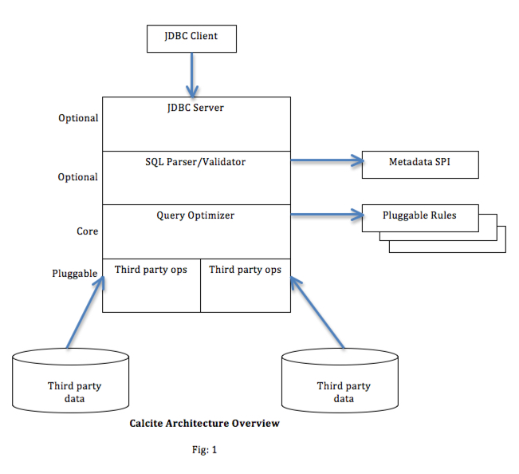
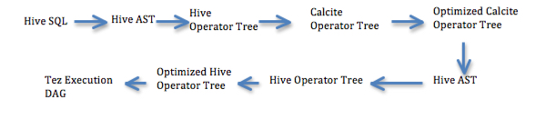
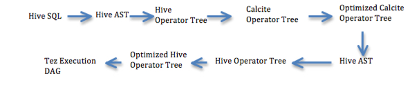
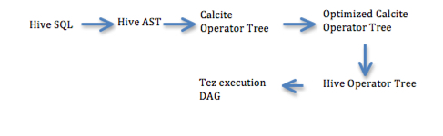

# Apache Hive : Cost-based optimization in Hive

* [Abstract]()
* [1. INTRODUCTION]()
* [2. RELATED WORK]()
* [3. BACKGROUND]()
* [4. Implementation details]()
* [5. Phase 1 – Work Items]()
* [Open Issues]()
* [Reference]()

# Abstract

Apache Hadoop is a framework for the distributed processing of large data sets using clusters of computers typically composed of commodity hardware. Over last few years Apache Hadoop has become the de facto platform for distributed data processing using commodity hardware. Apache Hive is a popular SQL interface for data processing using Apache Hadoop.

 

User submitted SQL query is converted by Hive to physical operator tree which is optimized and converted to Tez Jobs and is then executed on Hadoop cluster. Distributed SQL query processing in Hadoop differs from conventional relational query engine when it comes to handling of intermediate result sets. Hive query processing often requires sorting and reassembling of intermediate result set; this is called shuffling in Hadoop parlance.

 

Most of the existing query optimizations in Hive are about minimizing shuffling cost. Currently user would have to submit an optimized query to Hive with right join order for query to be executed efficiently. Logical optimizations in Hive are limited to filter push down, projection pruning and partition pruning. Cost based logical optimizations can significantly improve Apache Hive’s query latency and ease of use.

 

Join reordering and join algorithm selection are few of the optimizations that can benefit from a cost based optimizer. Cost based optimizer would free up user from having to rearrange joins in the right order or from having to specify join algorithm by using query hints and configuration options. This can potentially free up users to model their reporting and ETL needs close to business process without having to worry about query optimizations.

 

Calcite is an open source cost based query optimizer and query execution framework. Calcite currently has more than fifty query optimization rules that can rewrite query tree, and an efficient plan pruner that can select cheapest query plan in an optimal manner. In this paper we discuss how Calcite can be used to introduce Cost Based Logical Optimizer (CBO) in to Apache Hive.

 

CBO will be introduced in to Hive in a Phased manner. In the first phase, Calcite would be used to reorder joins and to pick right join algorithm so as to reduce query latency. Table cardinality and Boundary statistics will be used for this cost based optimizations.

# 1. INTRODUCTION

Hive is a data-warehousing infrastructure on top of Apache Hadoop. Hive takes advantage of Hadoop’s massive scale out and fault tolerance capabilities for data storage and processing on commodity hardware. Hive is designed to enable easy data summarization, ad-hoc querying and analysis of large volumes of data. Hive SQL is the declarative query language, which enables users familiar with SQL to do ad-hoc querying, summarization and data analysis easily.

In past Hadoop jobs tended to have high latencies and incurred substantial overheads in job submission and scheduling. As a result - latency for Hive queries was generally very high even when data sets involved were very small. As a result Hive was typically used for ETL and not much for interactive queries. With Hadoop2 and Tez the overheads for job submission and job scheduling have gone down significantly. In Hadoop version one, the jobs that could be executed could only be Map-Reduce Jobs.  With Hadoop2 and Tez that limitation no longer apply.

In Hadoop the output of mapper is sorted and sometimes persisted on the local disk of the mapper. This sorted mapper output is then send to appropriate reducer which then combines sorted results from different mappers.  While executing multiple map-reduce jobs where output of one job needs to be consumed by the successive map-reduce job, the output of preceding map-reduce job needs to be persisted into HDFS; this persistence is costly as the data needs to be copied to other nodes based on the replication factor of HDFS.

Hive on top of Hadoop version 1 often had to submit multiple map-reduce jobs to complete query processing. This Map-Reduce job pipeline degraded performance, as the intermediate result set now needs to be persisted to fault tolerant HDFS. Also submitting jobs and scheduling them were relatively costly operations. With Hadoop2 and Tez the cost of job submission and scheduling is minimized. Also Tez does not restrict the job to be only Map followed by Reduce; this implies all of the query execution can be done in a single job without having to cross job boundaries. This would result in a significant cost savings, as the intermediate result sets need not be persisted to HDFS or to even local disk.

Query optimizations in a relational query engine can be broadly classified as logical query optimizations and physical query optimizations. Logical query optimizations generally refer to query optimizations that can be derived based on relational algebra independent of the physical layer in which query is executed. Physical query optimizations are query optimizations that are cognizant of physical layer primitives. For Hive, the physical layer implies Map-Reduce and Tez primitives.

Currently logical query optimizations in Hive can be broadly categorized as follows:

* Projection Pruning
* Deducing Transitive Predicates
* Predicate Push down
* Merging of Select-Select, Filter-Filter in to single operator
* Multi-way Join
* Query Rewrite to accommodate for Join skew on some column values

 

Physical optimizations in Hive can be broadly classified as follows:

* Partition Pruning
* Scan pruning based on partitions and bucketing
* Scan pruning if query is based on sampling
* Apply Group By on the map side in some cases
* Perform Join on the Mapper
* Optimize Union so that union can be performed on map side only
* Decide which table to stream last, based on user hint, in a multi way join
* Remove unnecessary reduce sink operators
* For queries with limit clause, reduce the number of files that needs to be scanned for the table.
* For queries with Limit clause, restrict the output coming from mapper by restricting what Reduce Sink operator generates.
* Reduce the number of Tez jobs needed for answering user submitted SQL query
* Avoid Map-Reduce jobs in case of simple fetch query
* For simple fetch queries with aggregation, perform aggregation without Map-Reduce tasks
* Rewrite Group By Query to use index table instead of original table
* Use Index scans when predicates above table scan is equality predicates and columns in predicate have indexes on it.

In Hive most of the optimizations are not based on the cost of query execution. Most of the optimizations do not rearrange the operator tree except for filter push down and operator merging.  Most of the operator tree mutation is for removing reduce-sink and reducer operator.  Listed below are some of optimization decisions that can benefit from a CBO:

* How to order Join
* What algorithm to use for a given Join
* Should the intermediate result be persisted or should it be recomputed on operator failure.
* The degree of parallelism at any operator (specifically number of reducers to use).
* Semi Join selection

Calcite is an open source, Apache Licensed, query planning and execution framework. Many pieces of Calcite are derived from Eigenbase Project. Calcite has optional JDBC server, query parser and validator, query optimizer and pluggable data source adapters. One of the available Calcite optimizer is a cost based optimizer based on volcano paper. Currently different pieces of Calcite is used in following projects/products:

* Apache Drill
* Cascading (Lingual)
* Lucid DB
* Mondrian/Pentaho

Calcite currently has over fifty cost based optimization rules. Some of the prominent cost based optimization rules are listed below:

* Push Join through Union
* Push Filter past Table Function
* Join Reordering
* Semi Join selection
* Push Aggregate through Union
* Pull Aggregate through Union
* Pull Constants through Aggregate
* Merge Unions

In this document we propose to use Calcite’s cost based optimizer, Volcano, to perform Cost Based Optimizations in Hive. We propose to implement Calcite based CBO in a phased manner. Note here that proposal is to use Calcite’s optimizer only and nothing else. Listed below are the envisioned stages of introducing CBO in to Hive using Calcite:

* Phase1 – Join Reordering & Join algorithm Selection
	+ Table cardinality and boundary statistics will be used to compute operator cardinality.
	+ Hive operator tree will be converted to Calcite operator tree.
	+ Volcano optimizer in Calcite will be used to rearrange joins and to pick the join algorithm.
	+ Optimized Calcite operator tree would be converted back to Hive AST and will be executed as before. So all of the Hive’s existing optimizations would run on top of Calcite optimized SQL.
* Phase2 – Add support for Histograms, use other optimizations in Calcite
	+ Introduce space efficient histograms
	+ Change operator cardinality computation to use histograms
	+ Register additional optimization rules available in Calcite like the ones listed above.
* Phase3 – Code restructuring so that Calcite generates optimized Hive Operator tree
	+ Unlike phase1 Hive AST would be directly translated into Calcite operator tree.
	+ Optimize Calcite operator tree using Volcano optimizer.
	+ Convert optimized Calcite operator tree back into Hive Operator tree. This is unlike phase1 where optimized Calcite operator tree is converted to Hive AST.

# 2. RELATED WORK

## STATS

* histogram\_numeric(): Estimating frequency distributions: <https://cwiki.apache.org/confluence/x/CoOhAQ>
* histogram() UDAF for a numerical column <https://issues.apache.org/jira/browse/HIVE-1397>
* Built-in Aggregate Functions (UDAF): <https://cwiki.apache.org/confluence/x/-oKhAQ>
* Annotate hive operator tree with statistics from metastore: <https://issues.apache.org/jira/browse/HIVE-5369>

 

## PAPERS

* Query Optimization for Massively Parallel Data Processing

Sai Wu, Feng Li, Sharad Mehrotra, Beng Chin Ooi

*School of Computing, National University of Singapore, Singapore, 117590* 

*School of Information and Computer Science, University of California at Irvine*

 

* Profiling, What-if Analysis, and Cost-based Optimization of MapReduce Programs

Herodotos Herodotou Duke University, Shivnath Babu Duke University

 

* Optimizing Joins in a Map-Reduce Environment

Foto N. Afrati, National Technical University of Athens, Greece

Jeffrey D. Ullman, Stanford University USA

 

* Efficient and scalable statistics gathering for large databases in Oracle 11g

Sunil Chakkappen, Thierry Cruanes, Benoit Dageville, Linan Jiang, Uri Shaft, Hong Su, Mohamed Zait , Oracle Redwood Shores CA

<http://dl.acm.org/citation.cfm?doid=1376616.1376721>

 

* Estimating Distinct (Postgress SQL)

<http://wiki.postgresql.org/wiki/Estimating_Distinct>

 

* The History of Histograms

Yannis Ioannidis, Department of Informatics and Telecommunications, University of Athens

<http://www.vldb.org/conf/2003/papers/S02P01.pdf>

 

# 3. BACKGROUND

## Hive Query optimization issues

Hive converts user specified SQL statement to AST that is then used to produce physical operator tree. All of the query optimizations are performed on the physical operator tree. Hive keeps semantic info separate from query operator tree. Semantic info is extracted during plan generation that is then looked up often during down stream query optimizations. Adding new query optimizations into Hive is often made difficult by the lack of proper logical query plan and due to Semantic info and query tree separation.

## TEZ

Apache Tez generalizes the MapReduce paradigm to execute a complex DAG (directed acyclic graph) of tasks. Refer to the following link for more info.

<http://hortonworks.com/blog/apache-tez-a-new-chapter-in-hadoop-data-processing/>

## Join algorithms in Hive

Hive only supports equi-Join currently. Hive Join algorithm can be any of the following:

### Multi way Join

If multiple joins share the same driving side join key then all of those joins can be done in a single task.

Example: (R1 PR1.x=R2.a  - R2) PR1.x=R3.b - R3) PR1.x=R4.c - R4

All of the join can be done in the same reducer, since R1 will already be sorted based on join key x.

### Common Join

Use Mappers to do the parallel sort of the tables on the join keys, which are then passed on to reducers. All of the tuples with same key is given to same reducer. A reducer may get tuples for more than one key. Key for tuple will also include table id, thus sorted output from two different tables with same key can be recognized. Reducers will merge the sorted stream to get join output.

### Map Join

Useful for star schema joins, this joining algorithm keeps all of the small tables (dimension tables) in memory in all of the mappers and big table (fact table) is streamed over it in the mapper. This avoids shuffling cost that is inherent in Common-Join. For each of the small table (dimension table) a hash table would be created using join key as the hash table key.

 

### Bucket Map Join

If the joining keys of map-join are bucketed then instead of keeping whole of small table (dimension table) in every mapper, only the matching buckets will be kept. This reduces the memory footprint of the map-join.

### SMB Join

This is an optimization on Bucket Map Join; if data to be joined is already sorted on joining keys then hash table creation is avoided and instead a sort merge join algorithm is used.

### Skew Join

If the distribution of data is skewed for some specific values, then join performance may suffer since some of the instances of join operators (reducers in map-reduce world) may get over loaded and others may get under utilized. On user hint, hive would rewrite a join query around skew value as union of joins.

 

Example R1 PR1.x=R2.a  - R2 with most data distributed around x=1 then this join may be rewritten as (R1 PR1.x=R2.a and PR1.x=1   - R2) union all (R1 PR1.x=R2.a and PR1.x<>1   - R2)

 

# 4. Implementation details

CBO will be introduced in to Hive in three different phases. Following provides high-level overview of these phases: 

## Phase 1

 

Statistics:

* Table Cardinality
* Column Boundary Stats: min, max, avg, number of distinct values

 

Cost Based Optimizations:

* Join ordering
* Join Algorithm

 

Restrictions:

* Calcite CBO will be used only for select expressions
* Calcite CBO won’t be used if select expression contains any of the following operators:
	+ Sort By

Hive supports both total ordering (order by) and partial ordering (sort by). Partial ordering cannot be represented in relational algebra and SQL. In future we may represent Sort By as a table function.

* Map/Reduce/Transform

Hive allows users to specify map/reduce/transform operator in the sql; data would be transformed using provided mapper/reducer scripts. There is no direct translation for these operators to relational algebra. We may represent them as table function in future.

* Cluster By/Distribute By

*Cluster By* and *Distribute By* are used mainly with the [Transform/Map-Reduce Scripts](https://cwiki.apache.org/confluence/display/Hive/LanguageManual+Transform). But, it is sometimes useful in SELECT statements if there is a need to partition and sort the output of a query for subsequent queries. *Cluster By* is a short-cut for both *Distribute By* and *Sort By*. Hive uses the columns in *Distribute By* to distribute the rows among reducers. All rows with the same *Distribute By* columns will go to the same reducer. However, *Distribute By* does not guarantee clustering or sorting properties on the distributed keys.

* Table Sample

The TABLESAMPLE clause allows the users to write queries for samples of the data instead of the whole table. The TABLESAMPLE clause can be added to any table in the FROM clause. In future we may represent Table Sample as table function.

* Lateral Views

Lateral view is used in conjunction with user-defined table generating functions such as explode(). UDTF generates one or more output rows for each input row. A lateral view first applies the UDTF to each row of base table and then joins resulting output rows to the input rows to form a virtual table having the supplied table alias.

* UDTF (Table Functions)
* PTF (Partitioned Table Functions)

 

Calcite related enhancements:

* Introduce Operators to represent hive relational operators. Table Scan, Join, Union, Select, Filter, Group By, Distinct, Order By. These operators would implement a calling convention with physical cost for each of these operators.
* Introduce rules to convert Joins from CommonJoin to MapJoin, MapJoin to BucketJoin, BucketJoin to SMBJoin, CommonJoin to SkewJoin.
* Introduce rule to merge joins so that a single join operator will represent multi-way join (similar to MergedJoin in Hive).
* Merged-Join in Hive will be translated to MultiJoinRel in Calcite.

 

## Phase 2

Statistics:

* Histograms

 

Cost Based Optimizations:

* Join ordering based on histograms
* Join Algorithm – histograms are used for estimating join selectivity
* Take advantage of additional optimizations in Calcite. The actual rules to use is TBD.

## Phase 3

## Configuration

The configuration parameter [hive.cbo.enable]() determines whether cost-based optimization is enabled or not.

## Proposed Cost Model

Hive employs parallel-distributed query execution using Hadoop cluster. This implies for a given query operator tree different operators could be running on different nodes. Also same operator may be running in parallel on different nodes in the cluster, processing different partitions of the original relation. This parallel execution model induces high I/O and CPU costs. Hive query execution cost tends to be more I/O centric due to following reasons.

* Shuffling cost

Data needed by an operator from its child operator in query tree requires assembling data from all instances of child operator. This data then needs to be sorted and chopped up so that a partition of the relation is presented to an instance of the operator.

 

This shuffling cost involves cost of writing intermediate result set to local file system, cost of reading data back from local file system, and cost of transferring intermediate result set to the node that is operating child processor. In addition to I/O cost, shuffling also requires sorting of data that should be counted towards CPU cost.

 

* HDFS Read/Write is costly

Reading and writing data to HDFS is more costly compared to local FS. In Map-Reduce framework Table Scan would typically read data from HDFS and would write data to HDFS when switching between two Map-Reduce jobs. In Tez all of the operators should work with in a single Tez Job and hence we shouldn’t have to pay the cost of writing intermediate result set to HDFS.

 

Cost based optimizations in Hive will keep track of cost in terms of

* CPU usage
* IO Usage
* Cardinality
* Average size of the tuple in the relation.

 

Average size of the tuple in relation and cardinality of the relation will be used to estimate resources needed to hold a relation in memory. Memory needed to hold a relation is used to decide whether certain join algorithms, like Map/Bucket Join, can be used.

 

Volcano optimizer in Calcite compares cost of two equivalent query plans by getting cost of each operator in the tree and summing them up to find cumulative cost. Plan with lowest cumulative cost is picked as the best plan to execute the query. “VolcanoCost” is the Java class representing cost for Calcite’s Volcano optimizer. “VolcanoCost” comparison operators seem to take into consideration only the number of rows to decide if one cost is less than other.

 

For Hive we want to consider CPU and IO usage first before comparing cardinality.

We propose to introduce a new “RelOptCost” implementation “HiveVolcanoCost” derived from “VolcanoCost”. “HiveVolcanoCost” will keep CPU, I/O, Cardinality, and average size of tuple. Cost comparison algorithm will give importance to CPU and IO cost before paying attention to cardinality. CPU and IO cost will be stored in nano seconds granularity. Following is the pseudo code for “RelOptCost.isLe” function:

 

Class HiveVolcanoCost extends VolcanoCost {

Double m\_sizeOfTuple;

 

               @Override

                  public boolean isLe(RelOptCost other) {

                                    VolcanoCost that = (VolcanoCost) other;

                                    if (((this.dCpu + this.dIo) < (that.dCpu + that.dIo))

                                                                        || ((this.dCpu + this.dIo) == (that.dCpu + that.dIo)

                                                            && this.dRows <= that.dRows)) {

                                                      return true;

                                    } else {

                                                      return false;

                                    }

                  }

}

 

**Design Choice**:

In the absence of histograms, cardinality can be assumed to follow uniform distribution on the distinct values. With this approach cardinality/distinct computation could always follow same code path (Histograms). Alternative is to use heuristics when histograms are not available (like the one described by Hector Garcia Molina, Jeffrey D. Ullman and Jennifer Widom in “Database Systems”). Currently Hive statistics doesn’t keep track of the distinct values for an attribute (only the number of distinct values is kept); however from min, max,number of distinct values, and table cardinality uniformly distributed histogram can be constructed. Following describes formulas for a uniform histogram construction.

Number of buckets = (Max-Min)/No of distinct values.

Bucket width = (Max- Min)/ Number of buckets.

Bucket Height = Table cardinality/ Number of buckets.

 

In this paper for the cost formula, in the absence of histogram, we will follow heuristics described by Hector Garcia Molina, Jeffrey D. Ullman and Jennifer Widom in the book “Database Systems”.

 

**Following are the cost variables that will be used in cost computation**:

* Hr - This is the cost of Reading 1 byte from HDFS in nano seconds.
* Hw - This is the cost of Writing 1 byte to HDFS in nano seconds.
* Lr - This is the cost of Reading 1 byte from Local FS in nano seconds.
* Lw - This is the cost of writing 1 byte to Local FS in nano seconds.
* NEt – This is the average cost of transferring 1 byte over network in the Hadoop cluster from any node to any node; expressed in nano seconds.
* T(R) - This is the number of tuples in the relation.
* Tsz – Average size of the tuple in the relation
* V(R, a) –The number of distinct values for attribute a in relation R
* CPUc – CPU cost for a comparison in nano seconds

 

**Assumptions**:

* Relative cost of Disk, HDFS, and Network read/write with each other is more important than the exact true cost.
* We assume uniform cost regardless of hardware type, locality, and size of data involved in I/O, type of I/O scatter/gather vs. sequential read/write. This is obviously over simplification, but we are more interested in relative cost of operations.
* This cost model ignores the number of disk blocks that needs to be read/written from/to and instead look at number of bytes that needs to be read/written. This is an obvious oversimplification of I/O cost.
* This cost model also ignores storage layout, column store vs. others.
* We assume all of the tuples to be of uniform size.
* No colocation of tasks is assumed and hence we consider network transfer cost.
* For CPU cost, only comparison cost is considered. It is assumed that each comparison will cost 1 nano second.
* Each vertex in Tez is a different process
* HDFS read is assumed to be 1.5 times of local disk read and HDFS write is assumed to be 10 times of local disk write.

 

**Following are the assumed values for cost variables**:

* CPUc = 1 nano sec
* NEt = 150 * CPUc nano secs
* Lw = 4 * NEt
* Lr = 4 * NEt
* Hw = 10 * Lw
* Hr = 1.5 * Lr

 

### Table Scan

T(R) = Consult Metadata to get cardinality;

Tsz = Consult Metadata to get average tuple size;

V(R, a) = Consult Metadata

CPU Usage = 0;

IO Usage = Hr * T(R) * Tsz

 

### Common Join

T(R) = Join Cardinality estimation

Tsz = Consult Metadata to get average tuple size based on join schema;

CPU Usage = Sorting Cost for each of the relation + Merge Cost for sorted stream

                      = (T(R1) * log T(R1) * CPUc + T(R2) * log T(R2) * CPUc + … + T(Rm) * log T(Rm) * CPUc) + (T(R1) + T(R2) + …+ T(Rm)) * CPUc nano seconds;

 

IO Usage = Cost of writing intermediate result set in to local FS for shuffling + Cost of reading from local FS for transferring to Join operator node + Cost of transferring mapped output to Join operator node

                  = Lw * (T(R1) * Tsz1 + T(R2) * Tsz2 + …+ T(Rm) * Tszm)  + Lr * (T(R1) * Tsz1 + T(R2) * Tsz2 + …+ T(Rm) * Tszm) + NEt *  (T(R1) * Tsz1 + T(R2) * Tsz2 + … + T(Rm) * Tszm)

 

R1, R2… Rm is the relations involved in join.

Tsz1, Tsz2… Tszm are the average size of tuple in relations R1, R2…Rm.

 

### Map Join

Number of Rows = Join Cardinality estimation

Size of tuple = Consult Metadata to get average tuple size based on join schema

 

CPU Usage =HashTable Construction cost + Cost of Join

                      = (T(R2) + …+ T(Rm)) + (T(R1) + T(R2) + …+ T(Rm)) * CPUc nano seconds

 

IO Usage = Cost of transferring small tables to Join Operator Node * Parallelization of the join

                  = NEt *  (T(R2) * Tsz2 + … + T(Rm) * Tszm) * number of mappers

 

R1, R2… Rm is the relations involved in join and R1 is the big table that will be streamed.

Tsz2… Tszm are the average size of tuple in relations R1, R2…Rm.

 

### Bucket Map Join

Number of Rows = Join Cardinality estimation

Size of tuple = Consult Metadata to get average tuple size based on join schema;

 

CPU Usage =Hash Table Construction cost + Cost of Join

                      = (T(R2) + …+ T(Rm)) * CPUc + (T(R1) + T(R2) + …+ T(Rm)) * CPUc nano seconds

 

IO Usage = Cost of transferring small tables to Join * Parallelization of the join

                  = NEt *  (T(R2) * Tsz2 + … + T(Rm) * Tszm) * number of mappers

 

R1, R2… Rm is the relations involved in join.

Tsz2… Tszm are the average size of tuple in relations R2…Rm.

 

### SMB Join

Number of Rows = Join Cardinality estimation

Size of tuple = Consult Metadata to get average tuple size based on join schema;

 

CPU Usage = Cost of Join

                      = (T(R1) + T(R2) + …+ T(Rm)) * CPUc nano seconds

 

IO Usage = Cost of transferring small tables to Join * Parallelization of the join

                  = NEt *  (T(R2) * Tsz2 + … + T(Rm) * Tszm) * number of mappers

 

R1, R2… Rm is the relations involved in join.

Tsz2… Tszm are the average size of tuple in relations R2…Rm.

 

### Skew Join

Query will be rewritten as union of two joins. We will have a rule to rewrite query tree for skew join. Rewritten query will use the cost model for the join and union operators.

 

### Distinct/Group By

Number of Rows = Based on Group-By selectivity = V(R, a,b,c..) where a,b,c are the group by keys

Size of tuple = Consult Metadata to get average tuple size based on schema

 

CPU Usage = Cost of Sorting + Cost of categorizing into group

                      = (T(R) * log T(R) + T(R)) * CPUc nano seconds;

 

IO Usage = Cost of writing intermediate result set in to local FS for shuffling + Cost of reading from local FS for transferring to GB reducer operator node + Cost of transferring data set to GB Node

                  = Lw * T(R) * Tsz + Lr * T(R) * Tsz + NEt * T(R) * Tsz

 

### Union All

Number of Rows = Number of Rows from left + Number of Rows from right

Size of tuple = avg of (avg size of left, avg size of right)

CPU Usage = 0

IO Usage = Cost of writing intermediate result set in to HDFS + Cost of reading from HDFS for transferring to UNION mapper node + Cost of transferring data set to Mapper Node

                  = (T(R1) * Tsz1  + T(R2) * Tsz2) * Hw + (T(R1) * Tsz1 + T(R2) * Tsz2) * Hr + (T(R1) * Tsz1 + T(R2) * Tsz2) * NEt

 

R1, R2 is the relations involved in join.

Tsz1, Tsz2 is the average size of tuple in relations R1, R2.

 

### Filter/Having

Number of Rows = Filter Selectivity * Number of Rows from Child

Size of tuple = size of tuple from child operator

CPU Usage = T(R) * CPUc nano seconds

IO Usage = 0

### Select

Number of Rows = Number of Rows from Child

Size of tuple = size of tuple from child operator

CPU Usage = 0

IO Usage = 0

 

### Filter Selectivity

#### Without Histogram

* Equality Predicates where one side is a literal = 1/V(R, A)
* Equality Predicate when both sides are not literals = 1/max (V(R, A), V(R, B))
* In Equality Predicates (Less/Greater than) = 1/3
* Not Equal = (V(R, A) -1)/V(R, A)
* OR Condition = n*(1 –(1-m1/n)(1-m2/n)) where n is the total number of tuples from child and m1 and m2 is the expected number of tuples from each part of the disjunction predicate.
* AND condition = product of selectivity of individual leaf predicates in the conjunctive predicate

 

### Join Cardinality (without Histogram)

* Inner Join = Product of cardinalities of child relations * Join selectivity
* One side Outer Join = max (Selectivity of filter rejecting non joined inner tuples * (Product of cardinalities of child relations), Cardinality of Outer side)

Example: C(R1  a=b R2) = max (C(R2.b=R1.a C(R1 X R2)), C(R1))

* Full Outer Join = max (Selectivity of filter rejecting non joined inner tuples * (Product of cardinalities of child relations), sum of cardinalities of left and right relation)

= C(R1 a=b R2) = max (C(R1.a=R1.b C(R1 X R2)), C(R1) + C(R2))

* For multi-way join algorithm, join would be decomposed to number of different joins for cardinality and cost estimation.

 

#### Join Selectivity (without Histogram)

* Single Attribute  = 1/max (V(R1, a), V(R2, a))  where join predicate is R1.a=R2.a
* Multiple Attributes = 1/(max (V(R1, a), V(R2, a))   * max (V(R1, b), V(R2, b)) ) where join predicate is R1.a=R2.a and R1.b = R2.b

 

### Distinct Estimation

#### Inner Join - Distinct Estimation

* V(J, a) = V(R1, a) if attribute a comes only from one side of join; J is the relation representing Join output and R1 one of the relation involved.
* V(J, a) = max(V(R1, a), V(R2, a)) if attribute a is present in both sides of join; J is the relation representing Join output and R1, R2 are the relations involved in join.
* V(J, a) = V(R1, a) if attribute a comes only from one side of join; J is the relation representing Join output output and R1 is the relation from which attribute “a” comes from.
* V(J, a) = V(Ro, a) where Ro is the relation for the outer side; J is the relation representing Join output and Ro is the outer relation of the join.
* V(J, a) = V(R1, a) if attribute “a” comes only from one side of join; J is the relation representing Join output and R1 is the relation from which attribute a comes from.
* V(J, a) = max (V(R1, a), V(R2, a)) where J is the relation representing Join output and R1, R2 are the relations involved in join.
* V(U, a) = max (V(R1, a), V(R2, a)) where U is the relation representing Union All output and R1, R2 are the relations involved in union.

#### One sided Outer Join - Distinct Estimation

#### Full Outer Join - Distinct Estimation

#### Union All - Distinct Estimation

 

 

#### GB - Distinct Estimation

* V(G, a) = V(R, a) where G is the relation representing Group-By output and R is the child relation of Group-By. It is assumed attribute “a” is part of grouping keys.
* V(G, a,b,c) = max (V(R,a), V(R,b), V(R,c)) where G is the relation representing Group-By output and R is the child relation of Group-By. It is assumed attribute “a”, “b”, “c” is part of grouping keys.

 

#### Filter - Distinct Estimation

* V(F, a) = V(R, a) where F is the relation representing filter output and R is the child relation of the filter.

 

# 5. Phase 1 – Work Items

1. Walk the Hive OP tree and make sure that OP tree doesn’t contain any op that cannot be translated into Calcite (Lateral Views, PTF, Cubes & Rollups, Multi Table Insert).
2. Walk the Hive OP tree and introduce cast functions to make sure that all of the comparisons (implicit & explicit) are strictly type safe (the type must be same on both sides).
3. Implement Calcite operators specific to Hive that would do cost computation and cloning.
4. Convert the Hive OP tree to Calcite OP tree.
	1. Convert Hive Types to Calcite types
	2. Convert Hive Expressions to Calcite expressions
	3. Convert Hive Operator to Calcite operator
	4. Handle Hidden Columns
	5. Handle columns introduced by ReduceSink (for shuffling)
	6. Handle Join condition expressions stashed in Reducesink op
	7. Handle filters in Join Conditions
	8. Convert Hive Semi Join to Calcite
	9. Attach cost to operators
	10. Alias the top-level query projections to query projections that user expects.
5. Optimize the Calcite OP tree using Volcano Optimizer.
	1. Implement Rules to convert Joins to Hive Join algorithms.
		1. Common Join -> Map Join
		2. Map Join -> Bucket Map Join
		3. Common Join -> Bucket Map Join
		4. Bucket Map Join ->  SMB Join
		5. Common Join -> Skew Join
6. Walk the Optimized Calcite OP tree and introduce derived tables to convert OP tree to SQL.
	1. Generate unique table (including derived table) aliases
7. Walk the OP tree and convert in to AST.
	1. Stash Join algorithm in AST as query Hints
8. Modify Plan Generator to pay attention to Calcite query hints
9. Rerun Hive optimizer and generate the execution plan (this second pass would not invoke Calcite optimizer).

# Open Issues

1. CBO needs to differentiate between types of IPC (Durable-Local-FS vs, Durable-HDFS, Memory vs. Streaming)

# Reference

1. Database Systems The Complete Book, Second Edition, Hector Garcia-Molina, Jeffrey D. Ullman, Jennifer Widom
2. Query Optimization for Massively Parallel Data Processing

Sai Wu, Feng Li, Sharad Mehrotra, Beng Chin Ooi

*School of Computing, National University of Singapore, Singapore, 117590* 

*School of Information and Computer Science, University of California at Irvine*

## Attachments:

 

 

