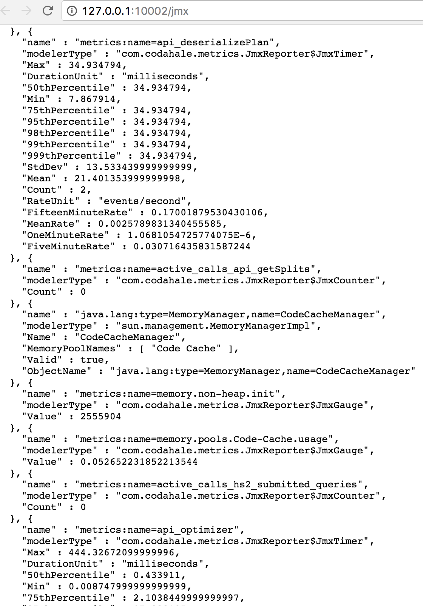

# Apache Hive : Hive Metrics

  

The metrics that Hive collects can be viewed in the [HiveServer2 Web UI]() by using the "Metrics Dump" tab.

The metrics dump will display any metric available over JMX encoded in JSON: 

Alternatively the metrics can be written directly into HDFS, a JSON file on the local file system where the HS2 instance is running or to the console by enabling the corresponding metric reporters. By default only the JMX and the JSON file reporter are enabled.

These metrics include:

* jvm.pause.info-threshold ([Hive 2.0.0](https://issues.apache.org/jira/browse/HIVE-10927))
* jvm.pause.warn-threshold ([Hive 2.0.0](https://issues.apache.org/jira/browse/HIVE-10927))
* jvm.pause.extraSleepTime ([Hive 2.0.0](https://issues.apache.org/jira/browse/HIVE-10927))
* open_connections ([Hive 2.0.0](https://issues.apache.org/jira/browse/HIVE-10927))
* open_operations ([Hive 2.0.0](https://issues.apache.org/jira/browse/HIVE-11984))
* cumulative_connection_count ([Hive 2.1.0](https://issues.apache.org/jira/browse/HIVE-12970))
* metastore_hive_locks ([Hive 2.0.0](https://issues.apache.org/jira/browse/HIVE-11903))
* zookeeper_hive_sharedlocks ([Hive 2.0.0](https://issues.apache.org/jira/browse/HIVE-11903))
* zookeeper_hive_exclusivelocks ([Hive 2.0.0](https://issues.apache.org/jira/browse/HIVE-11903))
* zookeeper_hive_semisharedlocks ([Hive 2.0.0](https://issues.apache.org/jira/browse/HIVE-11903))
* exec_async_queue_size ([Hive 2.0.0](https://issues.apache.org/jira/browse/HIVE-12271))
* exec_async_pool_size ([Hive 2.0.0](https://issues.apache.org/jira/browse/HIVE-12271))
* *HiveServer2 operations* ([Hive 2.0.0](https://issues.apache.org/jira/browse/HIVE-12271))
* *HiveServer2 operations completed* ([Hive 2.0.0](https://issues.apache.org/jira/browse/HIVE-12271))
* *SQL operations* ([Hive 2.1.0](https://issues.apache.org/jira/browse/HIVE-12987))
* *SQL operations completed* ([Hive 2.1.0](https://issues.apache.org/jira/browse/HIVE-12987))
* init_total_count_dbs ([Hive 2.1.0](https://issues.apache.org/jira/browse/HIVE-12499))
* init_total_count_tables ([Hive 2.1.0](https://issues.apache.org/jira/browse/HIVE-12499))
* init_total_count_partitions ([Hive 2.1.0](https://issues.apache.org/jira/browse/HIVE-12499))
* create_total_count_dbs ([Hive 2.1.0](https://issues.apache.org/jira/browse/HIVE-12733))
* create_total_count_tables ([Hive 2.1.0](https://issues.apache.org/jira/browse/HIVE-12733))
* create_total_count_partitions ([Hive 2.1.0](https://issues.apache.org/jira/browse/HIVE-12733))
* delete_total_count_dbs ([Hive 2.1.0](https://issues.apache.org/jira/browse/HIVE-12733))
* delete_total_count_tables ([Hive 2.1.0](https://issues.apache.org/jira/browse/HIVE-12733))
* delete_total_count_partitions ([Hive 2.1.0](https://issues.apache.org/jira/browse/HIVE-12733))
* directsql_errors ([Hive 2.1.0](https://issues.apache.org/jira/browse/HIVE-13585))
* waiting_compile_ops ([Hive 2.2.0](https://issues.apache.org/jira/browse/HIVE-13813))
* hive_mapred_tasks ([Hive 2.2.0](https://issues.apache.org/jira/browse/HIVE-14358))
* hive_spark_tasks ([Hive 2.2.0](https://issues.apache.org/jira/browse/HIVE-14358))
* hive_tez_tasks ([Hive 2.2.0](https://issues.apache.org/jira/browse/HIVE-14358))
* acquireReadWriteLocks ([Hive 0.8.0](https://issues.apache.org/jira/browse/HIVE-2364))
* compile ([Hive 0.8.0](https://issues.apache.org/jira/browse/HIVE-2364))
* doAuthorization ([Hive 0.8.0](https://issues.apache.org/jira/browse/HIVE-2364))
* Driver.execute ([Hive 0.8.0](https://issues.apache.org/jira/browse/HIVE-2364))
* releaseLocks ([Hive 0.8.0](https://issues.apache.org/jira/browse/HIVE-2364))
* prune-listing ([Hive 0.8.0](https://issues.apache.org/jira/browse/HIVE-2364))
* partition-retrieving ([Hive 0.8.0](https://issues.apache.org/jira/browse/HIVE-2364))
* PreHook ([Hive 0.8.0](https://issues.apache.org/jira/browse/HIVE-2364))
* PostHook ([Hive 0.8.0](https://issues.apache.org/jira/browse/HIVE-2364))
* FailureHook ([Hive 0.8.0](https://issues.apache.org/jira/browse/HIVE-2364))
* parse ([Hive 0.12.0](https://issues.apache.org/jira/browse/HIVE-5182))
* semanticAnalyze ([Hive 0.12.0](https://issues.apache.org/jira/browse/HIVE-5182))
* getInputSummary ([Hive 0.12.0](https://issues.apache.org/jira/browse/HIVE-5182))
* getSplits ([Hive 0.12.0](https://issues.apache.org/jira/browse/HIVE-5182))
* runTasks ([Hive 0.12.0](https://issues.apache.org/jira/browse/HIVE-5182))
* serializePlan ([Hive 0.12.0](https://issues.apache.org/jira/browse/HIVE-5182))
* deserializePlan ([Hive 0.12.0](https://issues.apache.org/jira/browse/HIVE-5182))
* clonePlan ([Hive 0.12.0](https://issues.apache.org/jira/browse/HIVE-5182))
* task ([Hive 0.12.0](https://issues.apache.org/jira/browse/HIVE-5182))
* optimizer ([Hive 2.0.0](https://issues.apache.org/jira/browse/HIVE-12526))
* Driver.run ([Hive 0.9.0](https://issues.apache.org/jira/browse/HIVE-2823))
* TezCompiler ([Hive 2.1.0](https://issues.apache.org/jira/browse/HIVE-13407))
* TezSubmitToRunningDag ([Hive 0.13.0](https://issues.apache.org/jira/browse/HIVE-5505))
* TezBuildDag ([Hive 0.13.0](https://issues.apache.org/jira/browse/HIVE-5505))
* TezSubmitDag ([Hive 0.13.0](https://issues.apache.org/jira/browse/HIVE-5505))
* TezRunDag ([Hive 0.13.0](https://issues.apache.org/jira/browse/HIVE-5505))
* TezCreateVertex ([Hive 0.13.0](https://issues.apache.org/jira/browse/HIVE-5505))
* TezRunVertex ([Hive 0.13.0](https://issues.apache.org/jira/browse/HIVE-5505))
* TezInitializeProcessor ([Hive 0.13.0](https://issues.apache.org/jira/browse/HIVE-5505))
* TezRunProcessor ([Hive 0.13.0](https://issues.apache.org/jira/browse/HIVE-5505))
* TezInitializeOperators ([Hive 0.13.0](https://issues.apache.org/jira/browse/HIVE-5505))
* LoadHashtable ([Hive 0.13.0](https://issues.apache.org/jira/browse/HIVE-5505))
* SparkSubmitToRunning ([Hive 1.1.0](https://issues.apache.org/jira/browse/HIVE-9136))
* SparkBuildPlan ([Hive 1.1.0](https://issues.apache.org/jira/browse/HIVE-9136))
* SparkBuildRDDGraph ([Hive 1.1.0](https://issues.apache.org/jira/browse/HIVE-9136))
* SparkSubmitJob ([Hive 1.1.0](https://issues.apache.org/jira/browse/HIVE-9136))
* SparkRunJob ([Hive 1.1.0](https://issues.apache.org/jira/browse/HIVE-9136))
* SparkCreateTran ([Hive 1.1.0](https://issues.apache.org/jira/browse/HIVE-9136))
* SparkRunStage ([Hive 1.1.0](https://issues.apache.org/jira/browse/HIVE-9136))
* SparkInitializeOperators ([Hive 1.1.0](https://issues.apache.org/jira/browse/HIVE-9136))
* SparkGenerateTaskTree ([Hive 1.1.0](https://issues.apache.org/jira/browse/HIVE-9136))
* SparkFlushHashTable ([Hive 1.1.0](https://issues.apache.org/jira/browse/HIVE-9136))
* SparkOptimizeOperatorTree ([Hive 1.1.0](https://issues.apache.org/jira/browse/HIVE-9164))
* SparkOptimizeTaskTree ([Hive 1.1.0](https://issues.apache.org/jira/browse/HIVE-9164))
* hs2_open_sessions ([Hive 2.2.0](https://issues.apache.org/jira/browse/HIVE-14753))
* hs2_active_sessions ([Hive 2.2.0](https://issues.apache.org/jira/browse/HIVE-14753))
* hs2_abandoned_sessions ([Hive 2.2.0](https://issues.apache.org/jira/browse/HIVE-14753))
* hs2_avg_open_session_time ([Hive 2.2.0](https://issues.apache.org/jira/browse/HIVE-14753))
* hs2_avg_active_session_time ([Hive 2.2.0](https://issues.apache.org/jira/browse/HIVE-14753))
* hs2_submitted_queries ([Hive 2.2.0](https://issues.apache.org/jira/browse/HIVE-14754))
* hs2_compiling_queries ([Hive 2.2.0](https://issues.apache.org/jira/browse/HIVE-14754))
* hs2_executing_queries ([Hive 2.2.0](https://issues.apache.org/jira/browse/HIVE-14754))
* hs2_failed_queries ([Hive 2.2.0](https://issues.apache.org/jira/browse/HIVE-14754))
* hs2_succeeded_queries ([Hive 2.2.0](https://issues.apache.org/jira/browse/HIVE-14754))
* GarbageCollectorMetricSet ([Hive 1.3.0](https://issues.apache.org/jira/browse/HIVE-10761)) - publishing attributes of GarbageCollectorMXBeans
* MemoryUsageGaugeSet ([Hive 1.3.0](https://issues.apache.org/jira/browse/HIVE-10761)) - publishing attributes of MemoryMXBeans
* ThreadStatesGaugeSet ([Hive 1.3.0](https://issues.apache.org/jira/browse/HIVE-10761)) - publishing attributes of ThreadMXBeans
* ClassLoadingGaugeSet ([Hive 1.3.0](https://issues.apache.org/jira/browse/HIVE-10761)) - publishing attributes of ClassLoadingMXBeans
* BufferPoolMetricSet ([Hive 1.3.0](https://issues.apache.org/jira/browse/HIVE-10761)) - publishing attributes of BufferPool JMX beans
* compaction_num_working ([Hive 4.0.0](https://issues.apache.org/jira/browse/HIVE-23702))
* compaction_num_initiated ([Hive 4.0.0](https://issues.apache.org/jira/browse/HIVE-23702))
* compaction_num_failed ([Hive 4.0.0](https://issues.apache.org/jira/browse/HIVE-23702))
* compaction_num_succeeded ([Hive 4.0.0](https://issues.apache.org/jira/browse/HIVE-23702))
* compaction_num_did_not_initiate ([Hive 4.0.0](https://issues.apache.org/jira/browse/HIVE-23702))
* compaction_num_ready_for_cleaning ([Hive 4.0.0](https://issues.apache.org/jira/browse/HIVE-23702))
* compaction_oldest_enqueue_age_in_sec ([Hive 4.0.0](https://issues.apache.org/jira/browse/HIVE-23702))
* api_compaction_initiator_cycle ([Hive 4.0.0](https://issues.apache.org/jira/browse/HIVE-24871))
* api_compaction_cleaner_cycle_minor ([Hive 4.0.0](https://issues.apache.org/jira/browse/HIVE-24871))
* api_compaction_worker_cycle_minor ([Hive 4.0.0](https://issues.apache.org/jira/browse/HIVE-24874))
* num_aborted_transactions ([Hive 4.0.0](https://issues.apache.org/jira/browse/HIVE-24955))
* oldest_aborted_txn_id ([Hive 4.0.0](https://issues.apache.org/jira/browse/HIVE-24955))
* oldest_aborted_txn_age_in_sec ([Hive 4.0.0](https://issues.apache.org/jira/browse/HIVE-24955))
* total_num_aborted_transactions ([Hive 4.0.0](https://issues.apache.org/jira/browse/HIVE-24955))
* total_num_committed_transactions ([Hive 4.0.0](https://issues.apache.org/jira/browse/HIVE-24955))
* total_num_timed_out_transactions ([Hive 4.0.0](https://issues.apache.org/jira/browse/HIVE-24955))
* num_locks ([Hive 4.0.0](https://issues.apache.org/jira/browse/HIVE-24985))
* oldest_lock_age_in_sec ([Hive 4.0.0](https://issues.apache.org/jira/browse/HIVE-24985))
* compaction_num_txn_to_writeid ([Hive 4.0.0](https://issues.apache.org/jira/browse/HIVE-24879))
* compaction_num_completed_txn_components ([Hive 4.0.0](https://issues.apache.org/jira/browse/HIVE-24879))
* compaction_num_initiators ([Hive 4.0.0](https://issues.apache.org/jira/browse/HIVE-24932))
* compaction_num_workers ([Hive 4.0.0](https://issues.apache.org/jira/browse/HIVE-24932))
* compaction_num_initiator_versions ([Hive 4.0.0](https://issues.apache.org/jira/browse/HIVE-24932))
* compaction_num_worker_versions ([Hive 4.0.0](https://issues.apache.org/jira/browse/HIVE-24932))
* oldest_open_repl_txn_id ([Hive 4.0.0](https://issues.apache.org/jira/browse/HIVE-25021))
* oldest_open_non_repl_txn_id ([Hive 4.0.0](https://issues.apache.org/jira/browse/HIVE-25021))
* oldest_open_repl_txn_age_in_sec ([Hive 4.0.0](https://issues.apache.org/jira/browse/HIVE-25021))
* oldest_open_non_repl_txn_age_in_sec ([Hive 4.0.0](https://issues.apache.org/jira/browse/HIVE-25021))
* tables_with_x_aborted_transactions ([Hive 4.0.0](https://issues.apache.org/jira/browse/HIVE-25037))
* num_writes_to_disabled_compaction_table ([Hive 4.0.0](https://issues.apache.org/jira/browse/HIVE-25079))
* oldest_ready_for_cleaning_age_in_sec ([Hive 4.0.0](https://issues.apache.org/jira/browse/HIVE-25080))
* compaction_num_active_deltas ([Hive 4.0.0](https://issues.apache.org/jira/browse/HIVE-24974))
* compaction_num_small_deltas ([Hive 4.0.0](https://issues.apache.org/jira/browse/HIVE-24974))
* compaction_initiator_failure_counter ([Hive 4.0.0](https://issues.apache.org/jira/browse/HIVE-25390))
* compaction_cleaner_failure_counter ([Hive 4.0.0](https://issues.apache.org/jira/browse/HIVE-25390))
* compaction_initiator_cycle_duration ([Hive 4.0.0](https://issues.apache.org/jira/browse/HIVE-25737))
* compaction_cleaner_cycle_duration ([Hive 4.0.0](https://issues.apache.org/jira/browse/HIVE-25737))
* compaction_oldest_working_age_in_sec ([Hive 4.0.0](https://issues.apache.org/jira/browse/HIVE-25737))
* compaction_oldest_cleaning_age_in_sec ([Hive 4.0.0](https://issues.apache.org/jira/browse/HIVE-25737))
* compaction_num_obsolete_deltas ([Hive 4.0.0](https://issues.apache.org/jira/browse/HIVE-24974))

Configuration properties for metrics can be found here:  [Metrics]().

See [HiveServer2 Overview]() for more information about HiveServer2.

## Attachments:

 

 

