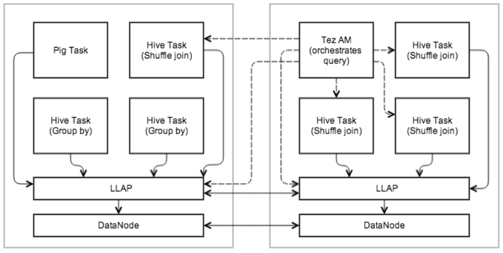

# Apache Hive : LLAP

* [Overview]()
* [Persistent Daemon]()
* [Execution Engine]()
* [Query Fragment Execution]()
* [I/O]()
* [Caching]()
* [Workload Management]()
* [ACID Support]()
* [Security]()
* [Monitoring]()
* [Web Services]()
* [SLIDER on YARN Deployment]()
* [LLAP Status]()
* [Resources]()

Live Long And Process (LLAP) functionality was added in Hive 2.0 ([HIVE-7926](https://issues.apache.org/jira/browse/HIVE-7926) and associated tasks). [HIVE-9850](https://issues.apache.org/jira/browse/HIVE-9850) links documentation, features, and issues for this enhancement.

For configuration of LLAP, see the LLAP Section of [Configuration Properties]().

## Overview

Hive has become significantly faster thanks to various features and improvements that were built by the community in recent years, including [Tez]() and [Cost-based-optimization](). The following were needed to take Hive to the next level:

* Asynchronous spindle-aware IO
* Pre-fetching and caching of column chunks
* Multi-threaded JIT-friendly operator pipelines

Also known as Live Long and Process, LLAP provides a hybrid execution model.  It consists of a long-lived daemon which replaces direct interactions with the HDFS DataNode, and a tightly integrated DAG-based framework.  
Functionality such as caching, pre-fetching, some query processing and access control are moved into the daemon.  Small/short queries are largely processed by this daemon directly, while any heavy lifting will be performed in standard YARN containers.

Similar to the DataNode, LLAP daemons can be used by other applications as well, especially if a relational view on the data is preferred over file-centric processing. The daemon is also open through optional APIs (e.g., InputFormat) that can be leveraged by other data processing frameworks as a building block.

Last, but not least, fine-grained column-level access control – a key requirement for mainstream adoption of Hive – fits nicely into this model.

The diagram below shows an example execution with LLAP. Tez AM orchestrates overall execution. The initial stage of the query is pushed into LLAP. In the reduce stage, large shuffles are performed in separate containers. Multiple queries and applications can access LLAP concurrently. 



## Persistent Daemon

To facilitate caching and JIT optimization, and to eliminate most of the startup costs, a daemon runs on the worker nodes on the cluster. The daemon handles I/O, caching, and query fragment execution.

* **These nodes are stateless.** Any request to an LLAP node contains the data location and metadata. It processes local and remote locations; locality is the caller’s responsibility (YARN).
* **Recovery/resiliency.** Failure and recovery is simplified because any data node can still be used to process any fragment of the input data. The Tez AM can thus simply rerun failed fragments on the cluster.
* **Communication between nodes.** LLAP nodes are able to share data (e.g., fetching partitions, broadcasting fragments). This is realized with the same mechanisms used in Tez.

## Execution Engine

LLAP works within existing, process-based Hive execution to preserve the scalability and versatility of Hive. It does not replace the existing execution model but rather enhances it.

* **The daemons are optional.** Hive can work without them and also is able to bypass them even if they are deployed and operational. Feature parity with regard to language features is maintained.
* **External orchestration and execution engines.** LLAP is not an execution engine (like MapReduce or Tez). Overall execution is scheduled and monitored by an existing Hive execution engine (such as Tez) transparently over both LLAP nodes, as well as regular containers. Obviously, LLAP level of support depends on each individual execution engine (starting with Tez). MapReduce support is not planned, but other engines may be added later. Other frameworks like Pig also have the choice of using LLAP daemons.
* **Partial execution.** The result of the work performed by an LLAP daemon can either form part of the result of a Hive query, or be passed on to external Hive tasks, depending on the query.
* **Resource Management.** YARN remains responsible for the management and allocation of resources. The [YARN container delegation](https://issues.apache.org/jira/browse/YARN-1488) model is used to allow the transfer of allocated resources to LLAP. To avoid the limitations of JVM memory settings, cached data is kept off-heap, as well as large buffers for processing (e.g., group by, joins). This way, the daemon can use a small amount of memory, and additional resources (i.e., CPU and memory) will be assigned based on workload.

## Query Fragment Execution

For partial execution as described above, LLAP nodes execute “query fragments” such as filters, projections, data transformations, partial aggregates, sorting, bucketing, hash joins/semi-joins, etc. Only Hive code and blessed UDFs are accepted in LLAP. No code is localized and executed on the fly. This is done for stability and security reasons.

* **Parallel execution.** An LLAP node allows parallel execution for multiple query fragments from different queries and sessions.
* **Interface.** Users can access LLAP nodes directly via client API. They are able to specify relational transformations and read data via record-oriented streams.

## I/O

The daemon off-loads I/O and transformation from compressed format to separate threads. The data is passed on to execution as it becomes ready, so the previous batches can be processed while the next ones are being prepared. The data is passed to execution in a simple RLE-encoded columnar format that is ready for vectorized processing; this is also the caching format, with the intent to minimize copying between I/O, cache, and execution.

* **Multiple file formats.** I/O and caching depend on some knowledge of the underlying file format (especially if it is to be done efficiently). Therefore, similar to Vectorization work, different file formats will be supported through plugins specific to each format (starting with ORC). Additionally, a generic, less-efficient plugin may be added that supports any Hive input format. The plugins have to maintain metadata and transform the raw data to column chunks.
* **Predicates and bloom filters.** SARGs and bloom filters are pushed down to storage layer, if they are supported.

## Caching

The daemon caches metadata for input files, as well as the data. The metadata and index information can be cached even for data that is not currently cached. Metadata is stored in process in Java objects; cached data is stored in the format described in the [I/O section](), and kept off-heap (see [Resource management]()).

* **Eviction policy.** The eviction policy is tuned for analytical workloads with frequent (partial) table-scans. Initially, a simple policy like LRFU is used. The policy is pluggable.
* **Caching granularity.** Column-chunks are the unit of data in the cache. This achieves a compromise between low-overhead processing and storage efficiency. The granularity of the chunks depends on the particular file format and execution engine (Vectorized Row Batch size, ORC stripe, etc.).

A bloom filter is automatically created to provide Dynamic Runtime Filtering.

## Workload Management

YARN is used to obtain resources for different workloads. Once resources (CPU, memory, etc.) have been obtained from YARN for a specific workload, the execution engine can choose to delegate these resources to LLAP, or to launch Hive executors in separate processes. Resource enforcement via YARN has the advantage of ensuring that nodes do not get overloaded, either by LLAP or by other containers. The daemons themselves is under YARN’s control.

## ACID Support

LLAP is aware of transactions. The merging of delta files to produce a certain state of the tables is performed before the data is placed in cache.

Multiple versions are possible and the request specifies which version is to be used. This has the benefit of doing the merge asynchronously and only once for cached data, thus avoiding the hit on the operator pipeline.

## Security

LLAP servers are a natural place to enforce access control at a more fine-grained level than “per file”. Since the daemons know which columns and records are processed, policies on these objects can be enforced. This is not intended to replace the current mechanisms, but rather to enhance and open them up to other applications as well.

## Monitoring

Configurations for LLAP monitoring are stored in resources.json, appConfig.json, metainfo.xml which are embedded into [templates.py](https://github.com/apache/hive/blob/master/llap-server/src/main/resources/templates.py) used by Slider.   
  
LLAP Monitor Daemon runs on YARN container, similar to LLAP Daemon, and listens on the same port.    
The LLAP Metrics Collection Server collects JMX metrics from all LLAP Daemons periodically.    
The list of LLAP Daemons are extracted from the Zookeeper server which launched in the cluster. 

## Web Services

[HIVE-9814](https://issues.apache.org/jira/browse/HIVE-9814) introduces the following web services:

JSON JMX data - /jmx  
JVM Stack Traces of all threads - /stacks  
XML Configuration from llap-daemon-site - /conf 

[HIVE-13398](https://issues.apache.org/jira/browse/HIVE-13398) introduces the following web services:

LLAP Status - /status  
LLAP Peers - /peers 

 

*/status example*

```
curl localhost:15002/status

{
  "status" : "STARTED",
  "uptime" : 139093,
  "build" : "2.1.0-SNAPSHOT from 77474581df4016e3899a986e079513087a945674 by gopal source checksum a9caa5faad5906d5139c33619f1368bb"
}
```

 

*/peers example*

```
curl localhost:15002/peers
{
  "dynamic" : true,
  "identity" : "718264f1-722e-40f1-8265-ac25587bf336",
  "peers" : [ 
 {
    "identity" : "940d6838-4dd7-4e85-95cc-5a6a2c537c04",
    "host" : "sandbox121.hortonworks.com",
    "management-port" : 15004,
    "rpc-port" : 15001,
    "shuffle-port" : 15551,
    "resource" : {
      "vcores" : 24,
      "memory" : 128000
    },
    "host" : "sandbox121.hortonworks.com"
  }, 
]
}
```

 

## SLIDER on YARN Deployment

LLAP can be deployed via [Slider](https://cwiki.apache.org/confluence/display/SLIDER/Slider+Home), which bypasses node installation and related complexities [(HIVE-9883](https://issues.apache.org/jira/browse/HIVE-9883)).

## LLAP Status

[AMBARI-16149](https://issues.apache.org/jira/browse/AMBARI-16149) introduces LLAP app status, available with HiveServer2.

Example usage.

```
/current/hive-server2-hive2/bin/hive --service llapstatus --name {llap\_app\_name} [-f] [-w] [-i] [-t]
```

```
 -f,--findAppTimeout <findAppTimeout>                 Amount of time(s) that the tool will sleep to wait for the YARN application to start. negative values=wait
                                                      forever, 0=Do not wait. default=20s
 -H,--help                                            Print help information
    --hiveconf <property=value>                       Use value for given property. Overridden by explicit parameters
 -i,--refreshInterval <refreshInterval>               Amount of time in seconds to wait until subsequent status checks in watch mode. Valid only for watch mode.
                                                      (Default 1s)
 -n,--name <name>                                     LLAP cluster name
 -o,--outputFile <outputFile>                         File to which output should be written (Default stdout)
 -r,--runningNodesThreshold <runningNodesThreshold>   When watch mode is enabled (-w), wait until the specified threshold of nodes are running (Default 1.0
                                                      which means 100% nodes are running)
 -t,--watchTimeout <watchTimeout>                     Exit watch mode if the desired state is not attained until the specified timeout. (Default 300s)
 -w,--watch                                           Watch mode waits until all LLAP daemons are running or subset of the nodes are running (threshold can be
                                                      specified via -r option) (Default wait until all nodes are running)
```

Version information

The findAppTimeout option was added in release 2.1.0 with [HIVE-13643](https://issues.apache.org/jira/browse/HIVE-13643):`-f` or `--``findAppTimeout`.

The watch and running nodes options were added in release 2.2.0 with [HIVE-15217](https://issues.apache.org/jira/browse/HIVE-15217) and [HIVE-15651](https://issues.apache.org/jira/browse/HIVE-15651): `-w` or `--watch`, `-i` or `--refreshInterval`, `-t` or `--watchTimeout`, and `-r` or `--runningNodesThreshold`.

 

## Resources

[LLAP Design Document](https://issues.apache.org/jira/secure/attachment/12665704/LLAPdesigndocument.pdf)

[Hive Contributor Meetup Presentation](https://cwiki.apache.org/confluence/download/attachments/27362054/LLAP-Meetup-Nov.ppsx?version=1&modificationDate=1447885307000&api=v2)

Save

Save

Save

Save

Save

Save

Save

Save

## Attachments:


 

 

