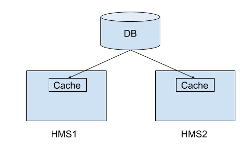
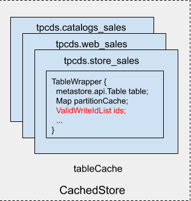
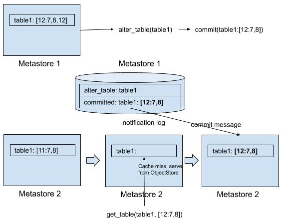

---

title: "Apache Hive : Synchronized Metastore Cache"
date: 2024-12-12
----------------

# Apache Hive : Synchronized Metastore Cache

# Overview

This work is to solve the consistency problem if we use HMS HA with metadata cache. Note it does not aim to address any existing consistency issues already exist in non-cached HMS. For example, it won’t fix the transaction semantic between metadata and data. If the problem exists today in non-cached HMS, it stays a problem after this work.

The problem we try to solve here is the cache consistency issue. We already build a HMS cache to cache the metadata. If we have multiple HMS in the cluster, the cache is not synchronized. That is, if metastore 1 changed a table/partition, metastore 2 won’t see the change immediately. There’s a background thread keep polling from the notification log and update changed entries, so the cache is eventually consistent. In this work, we want to make the cache full consistent. The idea is at read time, we will check if the cached entry is obsolete or not. However, we don’t want to penalize the read performance. We don’t want to introduce additional db call to compare the db version and cached version in order to do the check. The solution is we will use the transaction state of a query for the version check. A query will pull the transaction state of involved tables (ValidWriteIdList) from db (non-cached) anyway. So we don’t need additional db call to check the staleness of the cache.

.



# Data structure change

The only data structure change is adding ValidWriteIdList into SharedCache.TableWrapper, which represents the transaction state of the cached table.



Note there is no db table structure change, and we don’t store extra information in db. We don’t update TBLS.WRITE\_ID field as we will use db as the fact of truth. We assume db always carry the latest copy and every time we fetch from db, we will tag it with the transaction state of the query.

# How It Works

## Read

Metastore read request will compare ValidWriteIdList parameter with the cached one. If the cached version is fresh or newer (there’s no transaction committed after the entry is cached) , Metastore will use cached copy. Otherwise, Metastore will retrieve the entry from ObjectStore.

Here is the example for a get\_table request:

1. At the beginning of the query, Hive will retrieve the global transaction state and store in config (ValidTxnList.VALID\_TXNS\_KEY)
2. Hive translate ValidTxnList to ValidWriteIdList of the table [12:7,8,12](The format for writeid is [hwm:exceptions], all writeids from 1 to hwm minus exceptions, are committed. In this example, writeid 1..6,9,10,11 are committed)
3. Hive pass the ValidWriteIdList to HMS
4. HMS compare ValidWriteIdList [12:7,8,12] with the cached one [11:7,8] using TxnIdUtils.compare, if it is fresh or newer (Fresh or newer means no transaction committed between two states. In this example, [11:7,8] means writeid 1..6,9,10,11 are committed, the same as the requested writeid [12:7,8,12]), HMS return cached table entry
5. If the cached ValidWriteIdList is [12:7,12], the comparison fails because writeid 8 is committed since then. HMS will fetch the table from ObjectStore
6. HMS will eventually catch up with the newer version from notification log. HMS will serve the request from cache since then

Here is another example of get\_partitions\_by\_expr. The API is a list query not a point lookup. There are a couple of similarities and differences to point out:

1. HMS will still compare requested writeid and cached table writeid to decide if the request can serve from cache
2. Every add/remove/alter/rename partition request will increment the table writeid. HMS will mark cached table entry invalid upon processing the first write message from notification log, and mark it valid and tag with the right writeid upon processing the commit message from notification log

Write

Every write request will advance the write id for the table for both DML/DDL. The writeid will be marked committed locally in HMS client. The next read request is guaranteed to read from db until the notification log catch up to the commit message of the transaction commit, since the writeid is newer than the cache (the writeid for the transaction is committed locally, but is not committed on HMS until notification log catch up).

## Cache update

In the previous discussion, we know if the cache is stale, HMS will serve the request from ObjectStore. We need to catch up the cache with the latest change. This can be done by the existing notification log based cache update mechanism. A thread in HMS constantly poll from notification log, update the cache with the entries from notification log. The interesting entries in notification log are table/partition writes, and corresponding commit transaction message. When processing table/partition writes, HMS will put the table/partition entry in cache. However, the entry is not immediately usable until the commit message of the corresponding writes is processed, and mark writeid of corresponding table entry committed.

Here is a complete flow for a cache update when write happen (and illustrated in the diagram):

1. The ValidWriteIdList of cached table is initially [11:7,8]
2. HMS 1 get a alter\_table request. HMS 1 puts alter\_table message to notification log
3. The transaction in HMS 1 get committed. HMS 1 puts commit message to notification log
4. The cache update thread in HMS 2 will read the alter\_table event from notification log, update the cache with the new version from notification log. However, the entry is not available for read as writeid associate with it is not updated yet
5. A read for the entry on HMS 2 will fetch from db since the entry is not available for read
6. The cache update thread will further read commit event from notification log, mark writeid 12 as committed, the tag of cached table entry changed to [12:7,8]
7. The next read from HMS 2 will serve from cache



## Bootstrap

The use cases discussed so far are driven by a query. However, during the HMS startup, there’s a cache prewarm. HMS will fetch everything from db to cache. There is no particular query drives the process, that means we don’t have ValidWriteIdList of the query. Prewarm needs to generate ValidWriteIdList by itself. To do that, for every table, HMS will query the current global transaction state ValidTxnList (HiveTxnManager.getValidTxns), and then convert it to table specific ValidWriteIdList (HiveTxnManager.getValidWriteIds). As an optimization, we don’t have to invoke HiveTxnManager.getValidTxns per table. We can invoke it every couple of minutes. If ValidTxnList is outdated, we will get an outdated ValidWriteIdList. Next time when Hive read this entry, Metastore will fetch from the db even though it is in fact fresh. There’s no correctness issue, only impact performance in some cases. The other possibility is the entry changes after we fetches ValidWriteIdList. This is not unlikely as fetching all partitions of the table may take some time. If that happens, the cached entry is actually newer than the ValidWriteIdList. The next time Hive reads it will trigger a db read though it is not necessary. Again, there’s no correctness issue, only impact performance in some cases.

## Maintain WriteId

HMS will maintain ValidWriteIdList for every cache entry when transactions are committed. The initial ValidWriteIdList is brought in by bootstrap. After that, for every commit message, HMS needs to:

1. Find the table writeids associated with the txnid, this can be done by a db lookup on TXN\_TO\_WRITE\_ID table, or by processing ALLOC\_WRITE\_ID\_EVENT message in the notification log. I will explain later in detail
2. Mark the writeid as committed in the ValidWriteIdList associated with the cached tables

As an optimization, we can save a db lookup in #1 by cache the writeid of modified tables of the transaction. Every modified table will generate a corresponding ALLOC\_WRITE\_ID\_EVENT associate txnid with table writeid generated. Upon we receive commit message of the transaction, we can get the table writeids for the transaction. Thus we don’t need to do a db lookup to find the same information. However, in the initial commit message after bootstrap, we might miss some ALLOC\_WRITE\_ID\_EVENT for the transaction. To address this issue, we will use this optimization unless we saw the open transaction event as well. Otherwise, HMS will still go to the db to fetch the writeids.

## Deal with Rename

When we rename a table, writeids are renamed immediately on HMS (TxnHandler.onRename). However, cache won’t update immediately until it catches up the notification log. It is possible the cached table with the same table name is actually another table which is already dropped. To solve the issue, Hive session will fetch tableid of involved tables from db (must bypass cache) at the beginning of the transaction. It can be combined with HMS request for writeid. In every read request, HMS client need to pass tableid as well. HMS will compare the tableid with cached table. If it does not match, HMS will fetch the table from db instead.

## External Table

Write id is not valid for external tables. And Hive won’t fetch ValidWriteIdList if the query source is external tables. Without ValidWriteIdList, HMS won’t able to check the staleness of the cache. To solve this problem, we will use the original eventually consistent model for external tables. That is, if the table is external table, Hive will pass null ValidWriteIdList to metastore API/CachedStore. Metastore cache won’t store ValidWriteIdList alongside the entry. When reading, CachedStore always retrieve the current copy. The original notification update will update the metadata of external tables, so we can eventually get updates from external changes.

## Consistency Guarantee

Since the source of truth for cache is notification log, and the notification log is total ordered, the cache provides monotonic reads. The cost of that is we delay the update of cache until the notification log is caught up by the background thread. This guarantee the cache always move forward not backward. During the interim before HMS catch up the notification log, read will be served from db. The performance will suffer during this short period of time, but consider write operation is less often, the cost is minor.

The other benefit of this approach is it provide right semantic even if a transaction consists of more than one HMS write request. In that case, there are multiple copies of the cache entry could associate with a single writeid. For example, if there are two alter table request in the transaction, one request route to HMS 1 and the other route to HMS 2. We might not be able to tell which copy is applicable for this writeid if not carefully designed. By using notification log and only make cache available upon commit message, we can make sure we apply all request of the transaction. Once the commit message is processed, we can make sure the copy we have in cache is correct after this transaction.

This approach also provide read your own writes guarantee. Reads within the transaction will use a writeid list which marks the current transaction committed, that’s guaranteed to be newer than the cached entry, and thus HMS will go to db to fetch the fresh copy.

## Limitation

The check based on ValidWriteIdList is limited to table/partition. We cannot use the same mechanism for other entities such as databases, functions, privileges, as Hive only generate writeid on table (partition belong to table, so we use table writeid to track partition changes). Currently we don’t cache other entities, HMW will fetch those directly from db. However, many of those entities need to be in cache. For example, get\_database is invoked multiple times by every query. So we need to address this issue in the future.

API changes

When reading, we need to pass a writeid list so HMS can compare it with the cached version. We need to add ValidWriteIdList into metastore thrift API and RawStore interfaces for all table/partition related read calls.

Hive\_metastore.thrift and HiveMetaStoreClient.java

Adding a serialized version of ValidWriteIdList to every read HMS API.

| **hive\_metastore.thriftOld API** | **New API** |
| get\_table(string dbname,string tbl\_name) | get\_table(string dbname,string tbl\_name,int tableid,string validWriteIdList) |

Actually we don’t need to add the new field into every read request because:

1. Many APIs are using a request structure rather than taking individual parameters. So need to add ValidWriteIdList to the request structure instead
2. Some APIs already take ValidWriteIdList to invalidate outdated transactional statistics. We don’t need to change the API signature, but will reuse the ValidWriteIdList to validate cached entries in CachedStore

HMS read API will remain backward compatible for external table. That is, new server can deal with old client. If the old client issue a create\_table call, server side will receive the request of create\_table with tableid=0 and validWriteIdList=null, and will cache or retrieve the entry regardless(with eventual consistency model). For managed table, tableid and validWriteIdList are required and HMS server will throw an exception if validWriteIdList=null.

RawStore

ObjectStore will use the additional validWriteIdList field for all read methods to compare with cached ValidWriteIdList

| **Old API** | **New API** |
| getTable(String catName,String dbName,String tableName) | getTable(String catName,String dbName,String tableName,int tableid,String validWriteIdList) |

## Hive.java

The implementation details will be encapsulated in Hive.java. Which include:

1. Generate new write id for every write operation involving managed tables. Since DbTxnManager cache write id for every transaction, so every query will generate at most one new write id for a single table, even if it consists of multiple Hive.java write API calls
2. Pass the tableid and writeid to the read request of HMS client. It can be retrieved from config (for managed table, it guarantees to be there in config)

## Changes in Other Components

All other components invoking HMS API directly (bypass Hive.java) will be changed to invoke the newer HMS API. This includes HCatalog, Hive streaming, etc, and other projects using HMS client such as Impala.

For every read request involving table/partitions, HMS client (HiveMetaStoreClient) need to pass tableid and validWriteIdList string in addition to the existing arguments. tableid and validWriteIdList can be retrieved with txnMgr.getValidWriteIdsAndTblIds(). validWriteIdList can be null if it is external table, as HMS will return whatever in the cache for external table using eventual consistency. But if validWriteIdList=null for managed table, HMS will throw exception. validWriteIdList is a serialized form of [ValidReaderWriteIdList](https://github.com/apache/hive/blob/master/storage-api/src/java/org/apache/hadoop/hive/common/ValidReaderWriteIdList.java#L119). Usually ValidTxnWriteIdList can be obtained from [HiveTxnManager](https://github.com/apache/hive/blob/master/ql/src/java/org/apache/hadoop/hive/ql/lockmgr/HiveTxnManager.java) using the following code snippet:

```
HiveTxnManager txnMgr = TxnManagerFactory.getTxnManagerFactory().getTxnManager(conf);
ValidTxnList txnIds = txnMgr.getValidTxns(); // get global transaction state
ValidTxnWriteIdList
txnWriteIdsTblIds = txnMgr.getValidWriteIdsTableIds(txnTables, txnString); // map global transaction state to table specific write id
int tblId = txnWriteIdsTblIds.getTableId(fullTableName);
ValidWriteIdList writeids = txnWriteIds.getTableValidWriteIdList(fullTableName); // get table specific writeid
```

For every managed table write, advance the writeid for the table:

```
AcidUtils.advanceWriteId(conf, tbl);
```

## Attachments:


