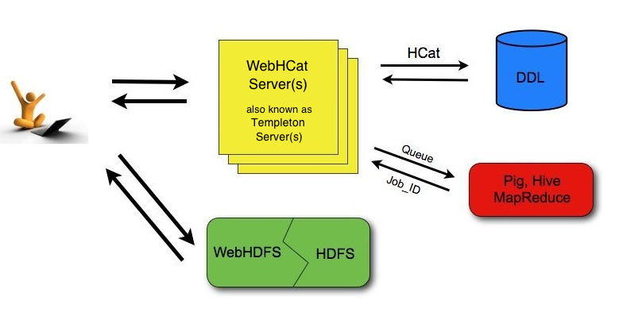

# Apache Hive : WebHCat UsingWebHCat

# Using the HCatalog REST API (WebHCat)

* [Using the HCatalog REST API (WebHCat)]()
	+ [Introduction to WebHCat]()
	+ [URL Format]()
	+ [Security]()
		- [Standard Parameters]()
			* [Specifying user.name]()
		- [Security Error Response]()
	+ [WebHDFS and Code Push]()
	+ [Error Codes and Responses]()
	+ [Log Files]()
	+ [Project Name]()

Version information

The HCatalog project graduated from the Apache incubator and merged with the Hive project on March 26, 2013.  
 Hive version 0.11.0 is the first release that includes HCatalog and its REST API, WebHCat.

## Introduction to WebHCat

This document describes the HCatalog REST API, *WebHCat*, which was previously called *Templeton*. If you are looking for a Hive GUI instead of an API, see [Hive Web Interface]() (removed in release 2.2.0).

As shown in the figure below, developers make HTTP requests to access [Hadoop](http://hadoop.apache.org/) [MapReduce](http://hadoop.apache.org/docs/stable/mapred_tutorial.html) (or [YARN](http://hadoop.apache.org/docs/current/hadoop-yarn/hadoop-yarn-site/YARN.html)), [Pig](http://pig.apache.org/), [Hive](http://hive.apache.org/), and [HCatalog DDL]() from within applications. Data and code used by this API are maintained in [HDFS](http://hadoop.apache.org/docs/stable/hdfs_user_guide.html). HCatalog DDL commands are executed directly when requested. MapReduce, Pig, and Hive jobs are placed in queue by WebHCat (Templeton) servers and can be monitored for progress or stopped as required. Developers specify a location in HDFS into which Pig, Hive, and MapReduce results should be placed.



WebHCat or Templeton?

For backward compatibility, the original name Templeton is still used for WebHCat in some contexts. See [#Project Name]() below.

## URL Format

HCatalog's REST resources are accessed using the following URL format:

`http://`*yourserver*`/templeton/v1/`*resource*

where "*yourserver*" is replaced with your server name, and "*resource*" is replaced with the HCatalog resource name.

For example, to check if the server is running you could access the following URL:

`ht``tp://www.myserver.com/templeton/v1/status`

See [Reference: WebHCat Resources]() for information about the individual REST resources.

## Security

The current version supports two types of security:

* Default security (without additional authentication)
* Authentication via [Kerberos](http://web.mit.edu/kerberos/)

### Standard Parameters

Every REST resource can accept the following parameters to aid in authentication:

* user.name: The user name as a string. Only valid when using default security.
* SPNEGO credentials: When running with Kerberos authentication.

#### Specifying user.name

The user.name parameter is part of POST parameters for POST calls, and part of the URL for other calls.

For example, to specify user.name in a GET :table command:

```
% curl -s 'http://localhost:50111/templeton/v1/ddl/database/default/table/my\_table?user.name=ctdean'

```

And to specify user.name in a POST :table command:

```
% curl -s -d user.name=ctdean \
       -d rename=test\_table\_2 \
       'http://localhost:50111/templeton/v1/ddl/database/default/table/test\_table'

```

### Security Error Response

If the user.name parameter is not supplied when required, the following error will be returned:

```
{
  "error": "No user found.  Missing user.name parameter."
}

```

## WebHDFS and Code Push

Data and code that are used by HCatalog's REST resources must first be placed in Hadoop. When placing files into HDFS is required you can use whatever method is most convienient for you. We suggest WebHDFS since it provides a REST interface for moving files into and out of HDFS.

## Error Codes and Responses

The server returns the following HTTP status codes.

* **200 OK:** Success!
* **400 Bad Request:** The request was invalid.
* **401 Unauthorized:** Credentials were missing or incorrect.
* **404 Not Found:** The URI requested is invalid or the resource requested does not exist.
* **500 Internal Server Error:** We received an unexpected result.
* **503 Busy, please retry:** The server is busy.

Other data returned directly by the server is returned in JSON format. JSON responses are limited to 1MB in size. Responses over this limit must be stored into HDFS using provided options instead of being directly returned. If an HCatalog DDL command might return results greater than 1MB, it's suggested that a corresponding Hive request be executed instead.

## Log Files

The server creates three log files when in operation:

* **templeton.log** is the log4j log. This the main log the application writes to.
* **templeton-console.log** is what Java writes to stdout when the server is started. It is a small amount of data, similar to "hcat.out".
* **tempelton-console-error.log** is what Java writes to stderr, similar to "hcat.err".

In the tempelton-log4j.properties file you can set the location of these logs using the variable templeton.log.dir. This log4j.properties file is set in the server startup script.

Hive log files are described in the [Hive Logging]() section of [Getting Started]().

## Project Name

The original work to add REST APIs to HCatalog was called Templeton. For backward compatibility the name still appears in URLs, log file names, etc. The Templeton name is taken from a character in the award-winning children's novel Charlotte's Web, by E. B. White. The novel's protagonist is a pig named Wilbur. Templeton is a rat who helps Wilbur by running errands and making deliveries as requested by Charlotte while spinning her web.

 

**Navigation Links**
Next: [WebHCat Installation]()

General: [WebHCat Manual]() – [HCatalog Manual]() – [Hive Wiki Home]() – [Hive Project Site](http://hive.apache.org/)

## Attachments:


 

 

